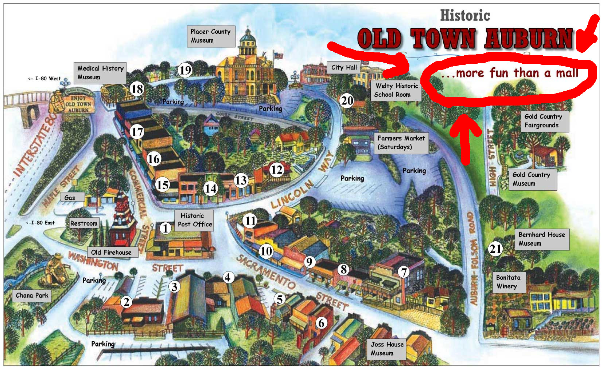

I grew up in

  Auburn, California
  

where I was introduced to rock climbing, slacklining, computers, music,
bicycle riding, and pretty much everything that I'm into today.

After high school, I moved to Los Angeles to study computer science at UCLA.
I graduated in 2018 and moved up to San Francisco where I now work at Stripe.

I try to spend most of my free time slacklining, climbing, or reading,
but I also spend a lot of time with computers.

I've been spending most of that time playing with Linux,
learning new programming languages, and building websites.
One of the thing that excites me the most about computers is the potential for
improved educational materials that make use of interactive visualizations
and explanations that can help learners understand and develop intuition about
the world around them.

You can find out more about me on all the usual platforms:

- [facebook](https://fb.com/jamesbvaughan)
- [github](https://github.com/jamesbvaughan)
- [instagram](https://www.instagram.com/jamesontheline/)
- [last.fm](http://www.last.fm/user/magicjamesv)
- [letterboxd](https://letterboxd.com/jamesbvaughan/)
- [linkedin](https://linkedin.com/in/jamesbvaughan)
- [twitter](https://twitter.com/jamesontheline)
