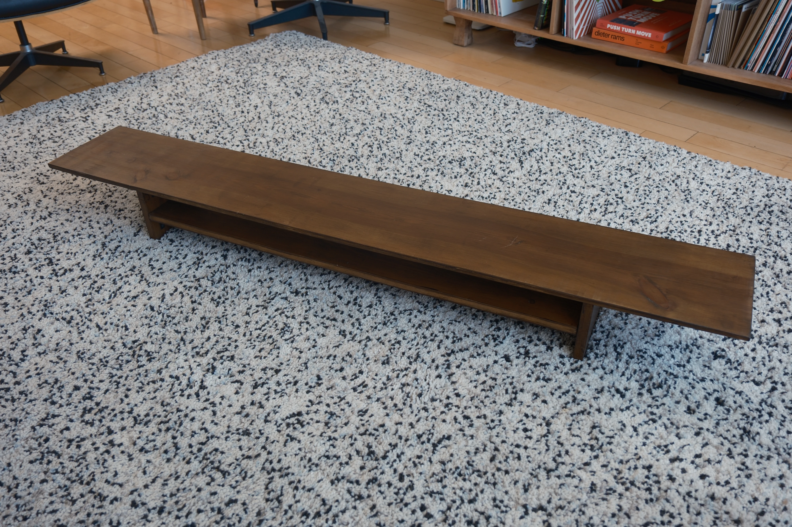
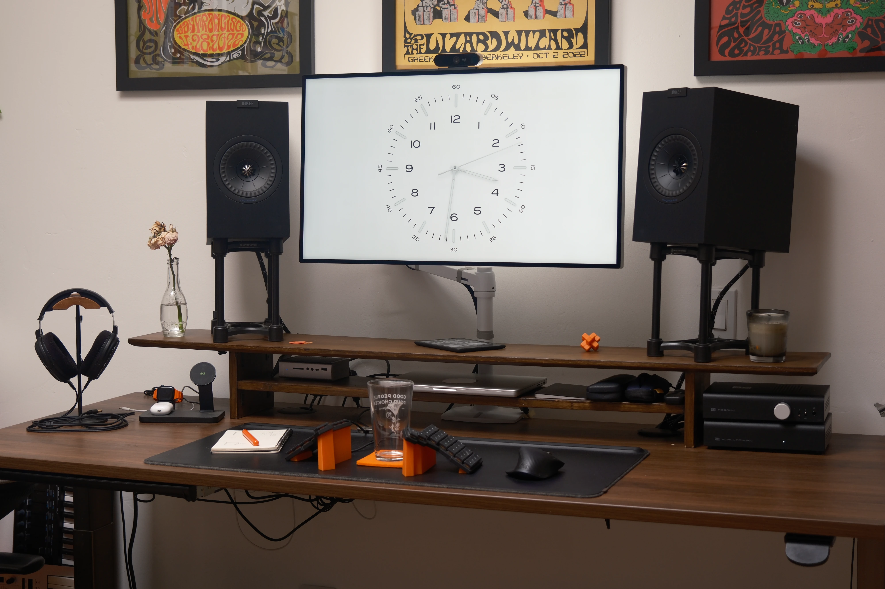
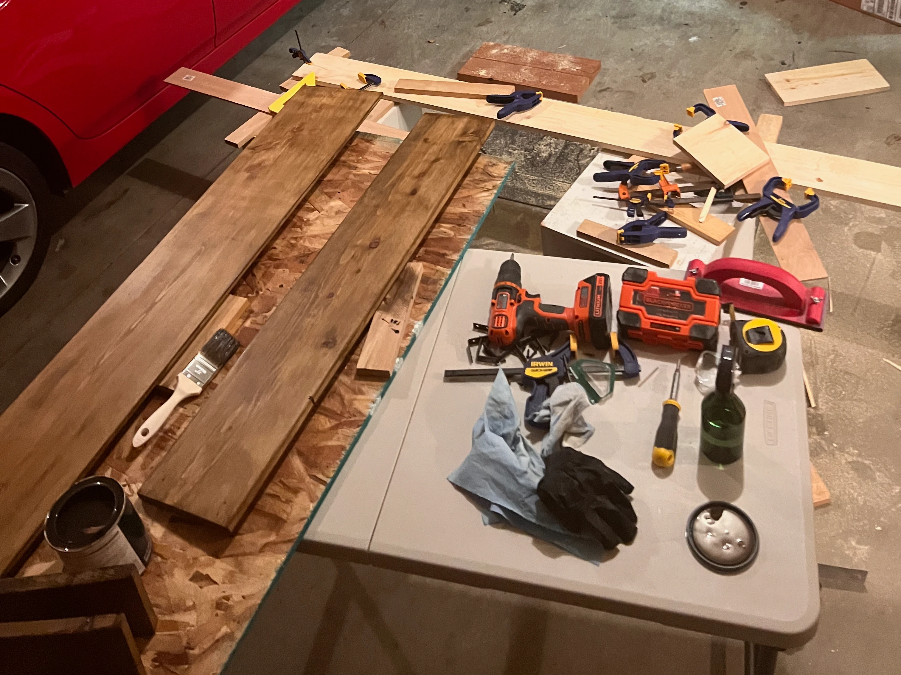
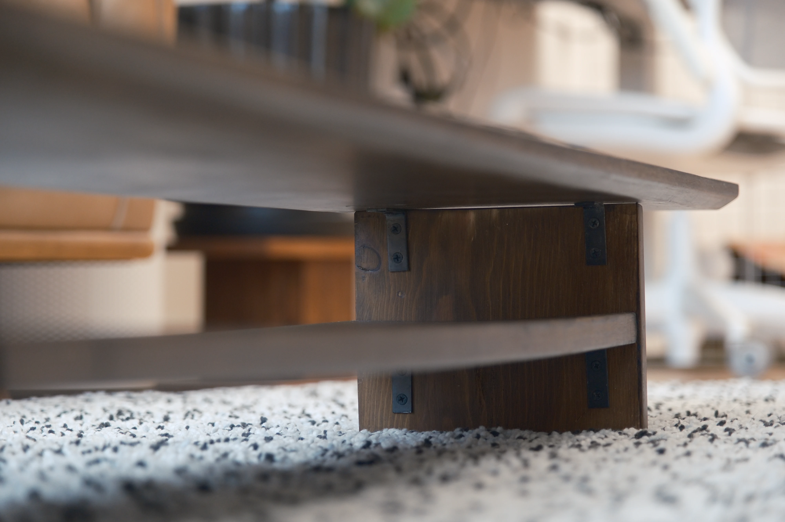

I built this desk riser for my home office.

The primary motivations were to get my display up to eye height and my speakers
up to ear height, and it succeeded at both!

These days, I have my display mounted to an arm, but the riser is still useful
for the speakers.

I only took one photo during the build, unfortunately.
This was my first real woodworking project and I had no idea what I was doing.

I made the cuts and chamfered the edges with a circular saw, which I had never
used before, and somehow did an okay job.

In retrospect, I would have been better off with a hand saw for the main cuts
and a router for the chamfer, but I learned a lot!

# Materials

- Basic construction lumber (Maybe Pine? I didn't know what I was buying at that
point)
