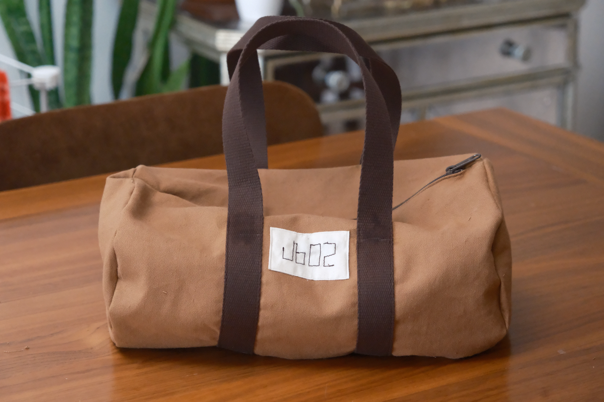
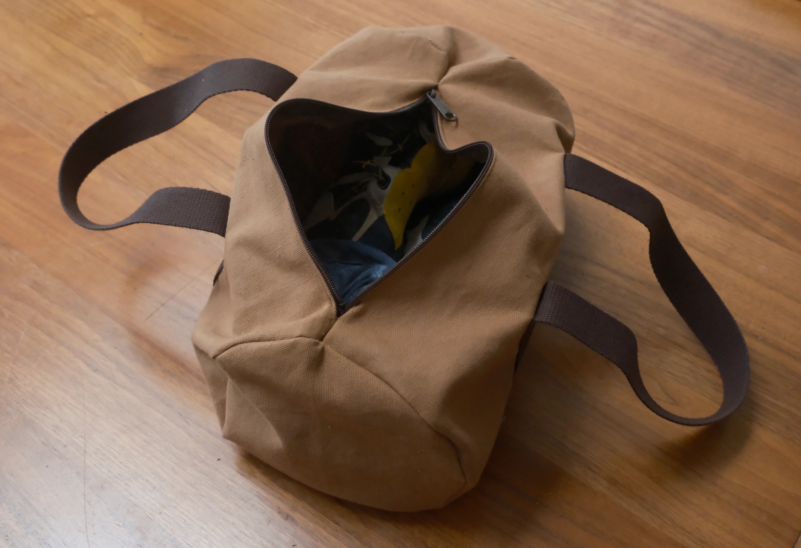
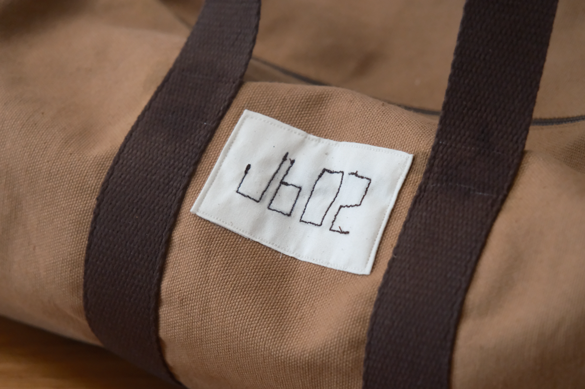

I made this bag for carrying my climbing shoes and chalk to the gym.

I like the style of classic simple duffel bags and I wanted one that was _just_
big enough for my shoes and chalk bag.

The bag's label reads "Jb02" for "James' Bags, Model Number 2".

# Materials

- 10oz 100% Cotton Duck Canvas
- 30mm Cotton Webbing
- YKK #4.5 Nylon Coil Bag Zipper
