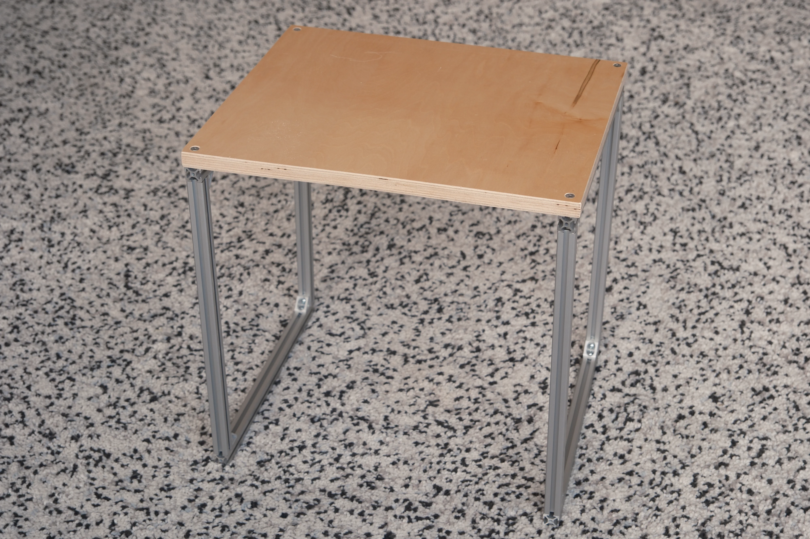
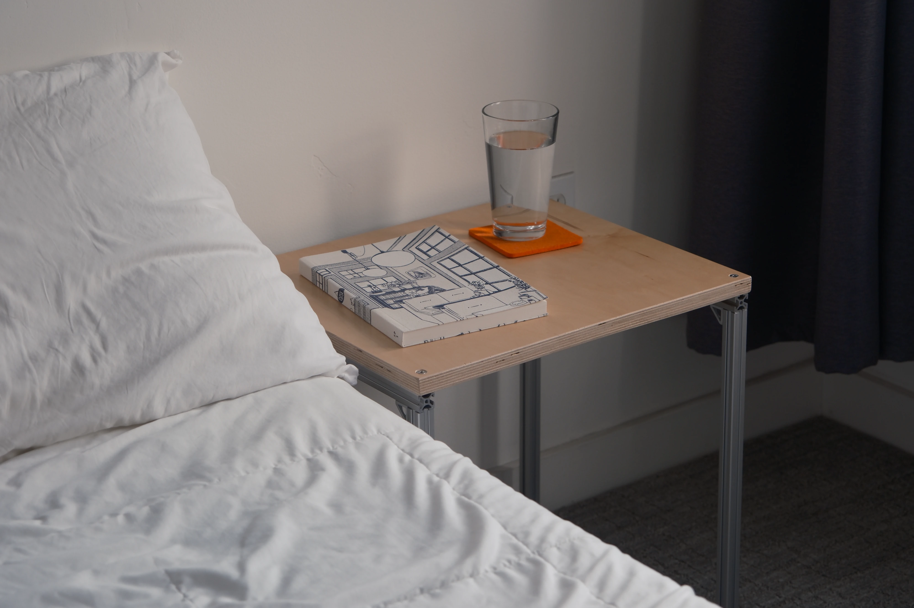
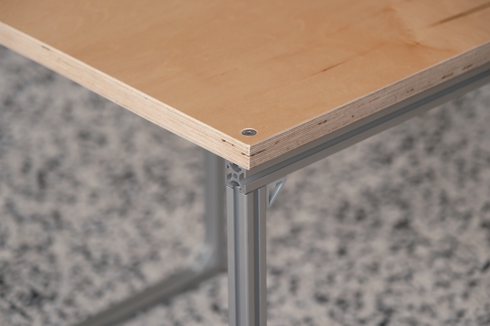

I built this night table using leftover materials from the Meadow Desk.

I had been using a flimsy plastic nightstand for way too long.
This was a nice upgrade in stability and aesthetic.

# Materials

- 3/4" Birch Plywood
- [20mm Aluminum 20mm T-Slotted Rails](https://www.mcmaster.com/5537T101/)
- [M5 Stainless Steel Screws](https://www.mcmaster.com/93395A313/)
