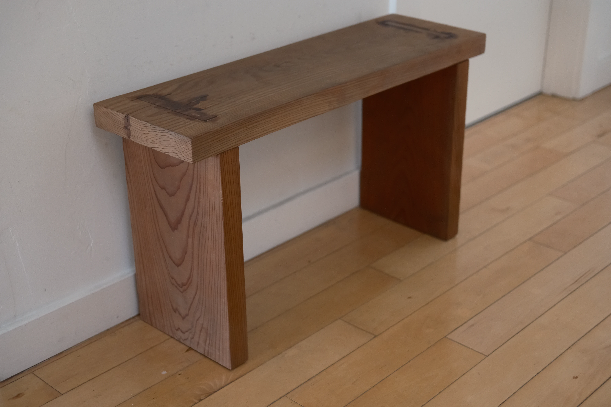
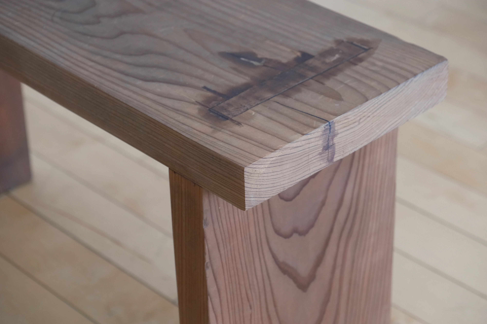

I built this bench for me to sit on while I put my shoes on before I leave the
apartment and while I take them off after I arrive.

I decided to try not to use any hardware for the joinery on this, using a
mortise-and-tenon joint.
For some reason, I didn't consult any resources for learning how to create a
mortise-and-tenon.
I made it a lot more difficult than I needed to and the final result isn't
pretty, but it works!

# Materials

- Reclaimed Redwood
- A lot more wood glue than I should have needed
