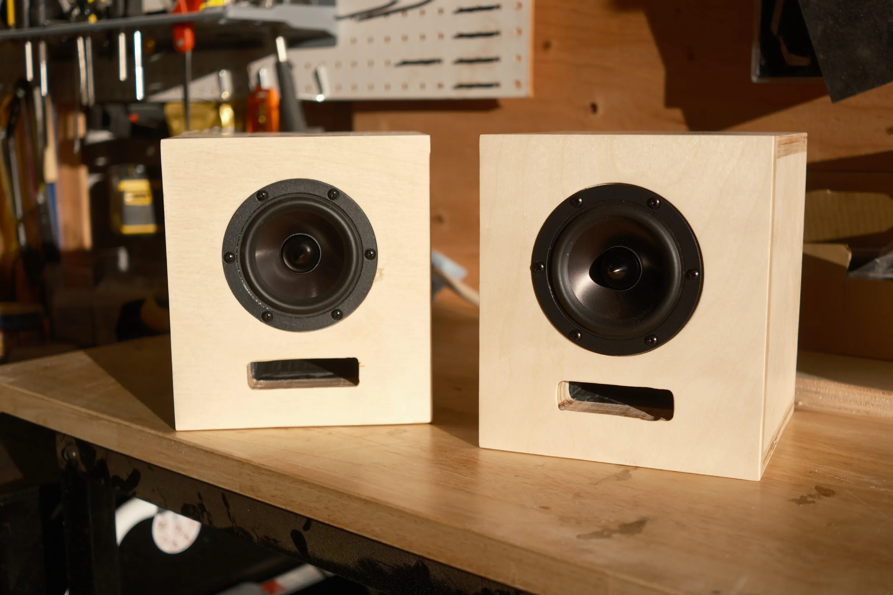
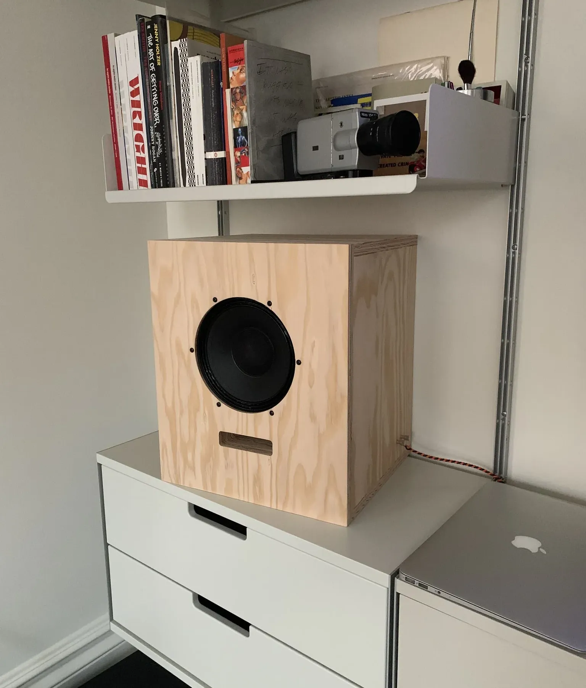
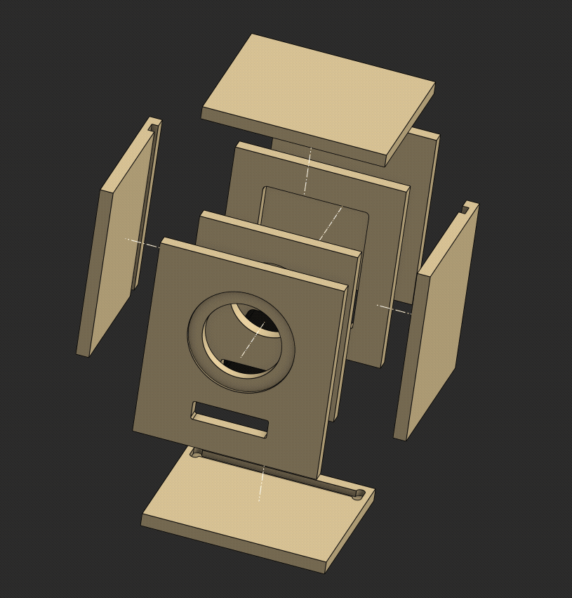
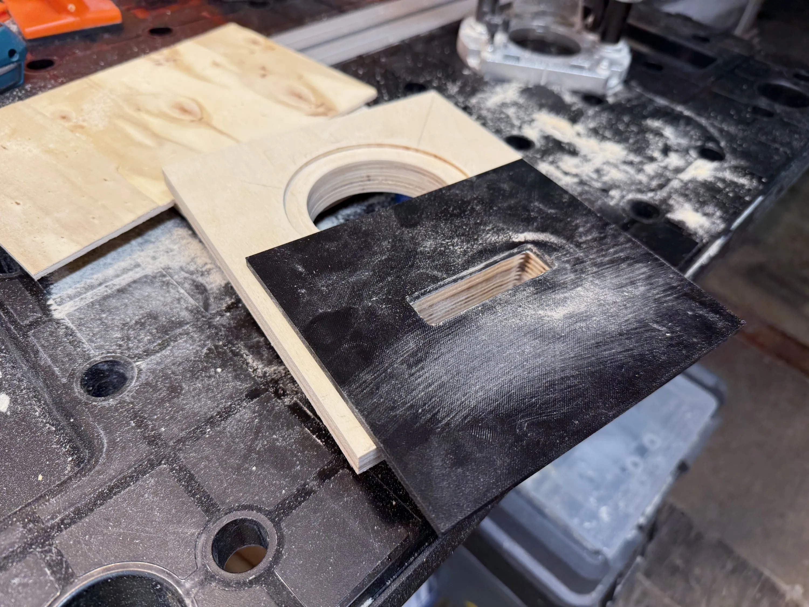
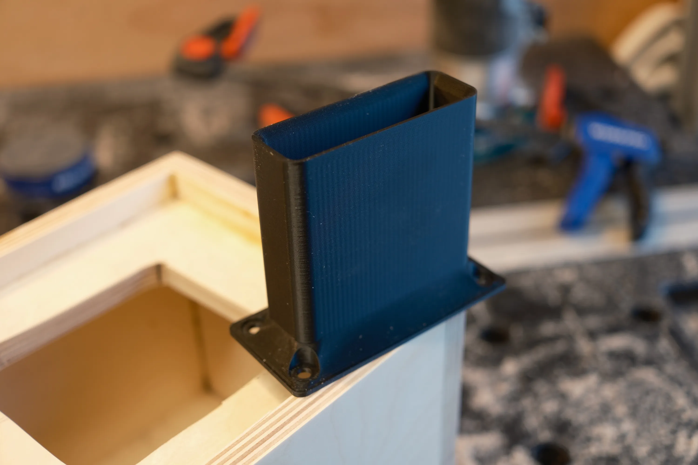
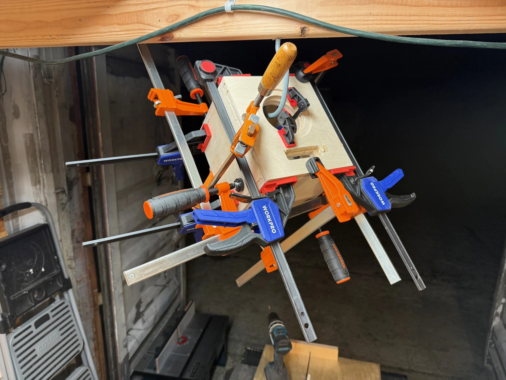
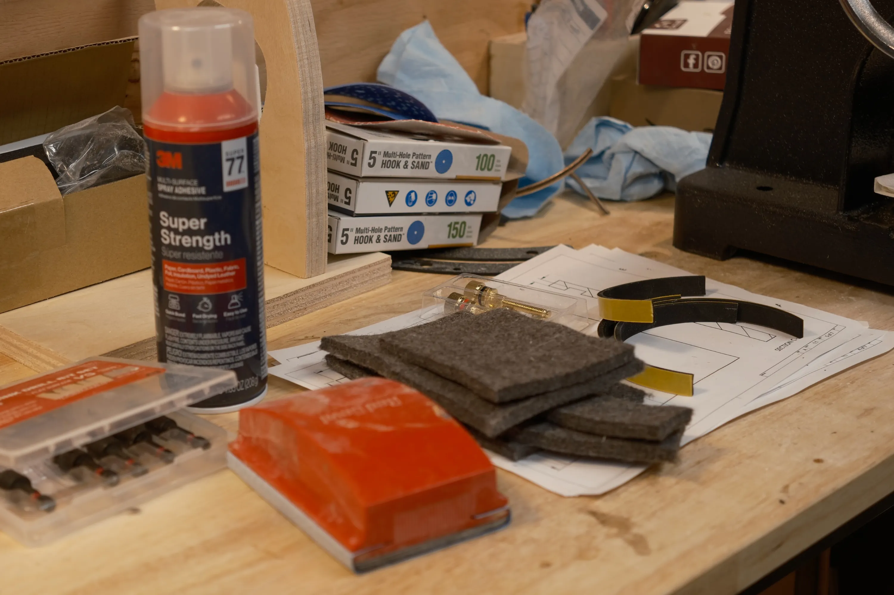
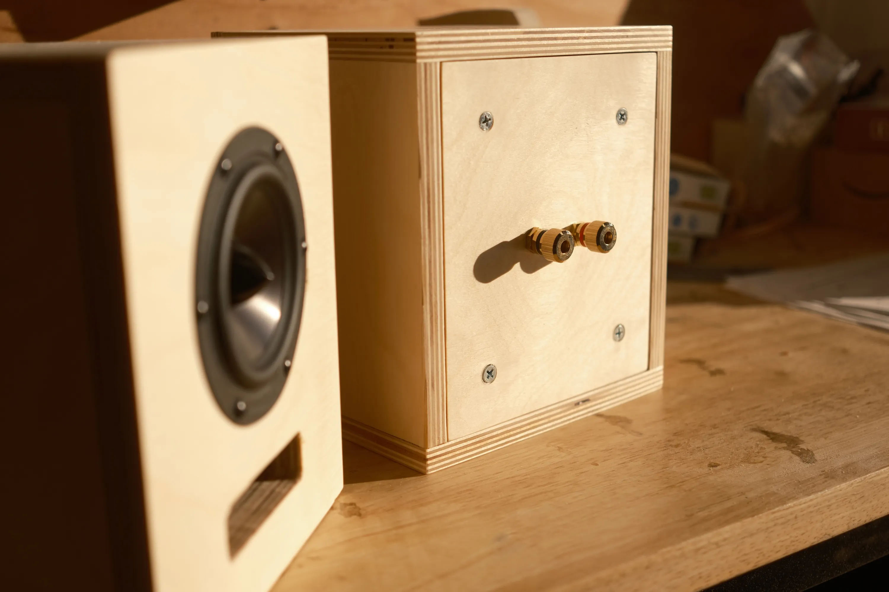
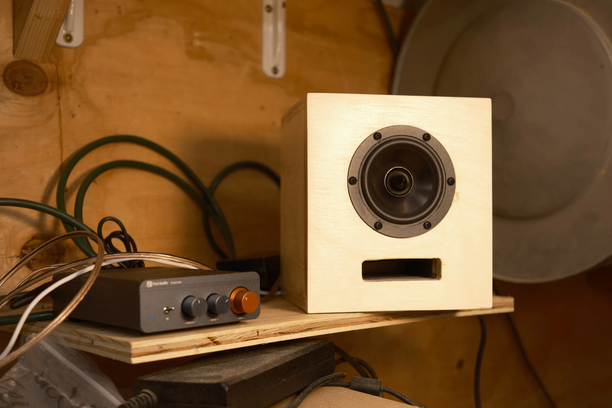

I made this pair of speakers for me and Kyle's workshop.

I've wanted to build speakers for a long time, but only recently built out a
workshop where I could do it.

# Design

I designed these to look like a miniature version of the [Ojas Artbook Shelf
Speaker](https://ojas.nyc/products/artbook-shelf-speaker-2):

I prioritized aesthetics over technically optimal acoustic design in a few ways,
but these will live in our small shipping container workshop which always has
other sounds going, and in that environment they're perfect.

I modeled the enclosures and the port tube in Onshape.
This was my first serious project in Onshape and I'm quite pleased with it!

You can view and fork the Onshape project
[here](https://cad.onshape.com/documents/59579d84814e37b714576ec1/w/e8abd1f3cc56591ce439781c/e/602d82fec2e42e8ebd322a90?renderMode=0&uiState=69707298c24a90c02601669f).

# Drivers

I chose the [Dayton Audio RS100-8 4" Full-Range driver](https://www.parts-express.com/Dayton-Audio-RS100-4-4-Reference-Full-Range-Driver-4-Ohm-295-378)
for these speakers.
I went with that one because
- it's well-reviewed
- it seems to have worked well as a full-range driver in other peoples' projects
- it looks nice

Parts Express has a [bunch](https://www.parts-express.com/speaker-components/hi-fi-woofers-subwoofers-midranges-tweeters/midrange-midbass-drivers-full-range-speakers/nominaldiameter/4)
of contenders for 4" drivers, some of which more closely match the look of the
JBL 328c that's in the Ojas speakers,
but these reference series Daytons seemed like the most versatile option.

# Build

I initially thought I might cut the panels on Kyle's CNC, but we were still
waiting for some parts for the CNC to arrive, so I ended up cutting everything
by hand with the table saw, jigsaw, and handheld router.

I used [this circle jig](https://www.amazon.com/dp/B084X5QXZ5) to cut the hole
for the driver with a handheld router in a plunge base.

After sloppily trying to freehand the cutout for the port with a jigsaw on the
first speaker, I printed a PETG template to route out the second one.

The Ojas speakers feature a port tube made from the same plywood as the
enclosure.
I probably could have gotten by with that, but instead I opted to design and
print slimmer ones for this smaller build.

The glue-up got a bit out-of-hand.
I was eager to finish these quickly and chose to glue everything at once, which
required an absurd collection of clamps and a hook in the ceiling.

I lined the inside top and side walls with
[this industrial felt](https://www.amazon.com/dp/B004E5GWFE)
and sealed the interface between the back brace and the back panel with
[this foam tape](https://www.amazon.com/dp/B07PZTQRHL).

# Amp

I'm powering these with the [Fosi Audio BT20A
Pro](https://fosiaudio.com/products/bt20a-pro-2-channel-bluetooth-power-amplifier?variant=46048805126374).

I chose that amp specifically because
- it's small
- it's relatively inexpensive
- it has a built-in Bluetooth receiver and DAC
- it has bass and treble knobs to help offset my lack of enclosure tuning and
the weird shipping container acoustics

# Materials and approximate cost

- ~8sqft 1/2" Baltic birch plywood - **$30**
- 2 Dayton Audio RS100-8 drivers - **$37**
- 2 pairs of binding posts - **$22**
- 1sqft industrial 1/4" felt - **$10**
- 2 feet of 1/8" foam tape - **$1**
- 100g PETG - **$3**

Plus small hard-to-price amounts of:
- screws
- wood glue
- spray adhesive
- sandpaper
- wood finish
- speaker wire
- solder

In total I'd estimate my material costs to be about $110 for the pair.

---

The primary goal of this project was to end up with a good way to listen to
music in the shop.
The secondary goal was for me to sharpen my carpentry skills and learn some new
ones.
It was a great success on both fronts!
