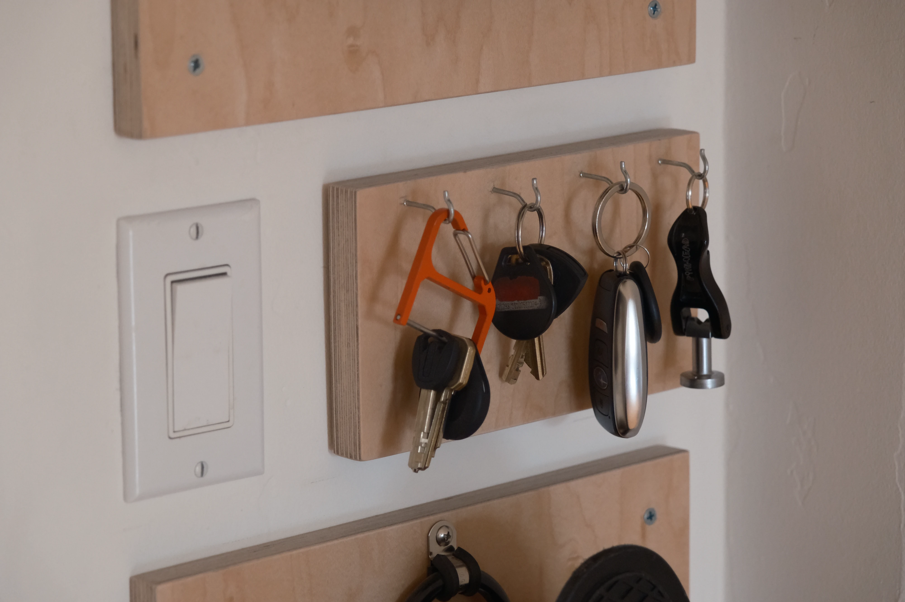

I built these wall mounts for my and Gabrielle's skateboards and our keys for
easy access by the front door.

I know you're not supposed to put photos of your keys on the internet, but I
think the teeth are sufficiently obscured here.

The backboards are aligned with the existing fixtures on the wall.

If you want to use something regularly, find a way to store it that makes it
as accessible as possible!

# Materials

- 3/4" Birch Plywood
- Stainless Steel Screws and Hooks
- [Skateboard Hangers](https://www.amazon.com/dp/B083CYX7W6)
