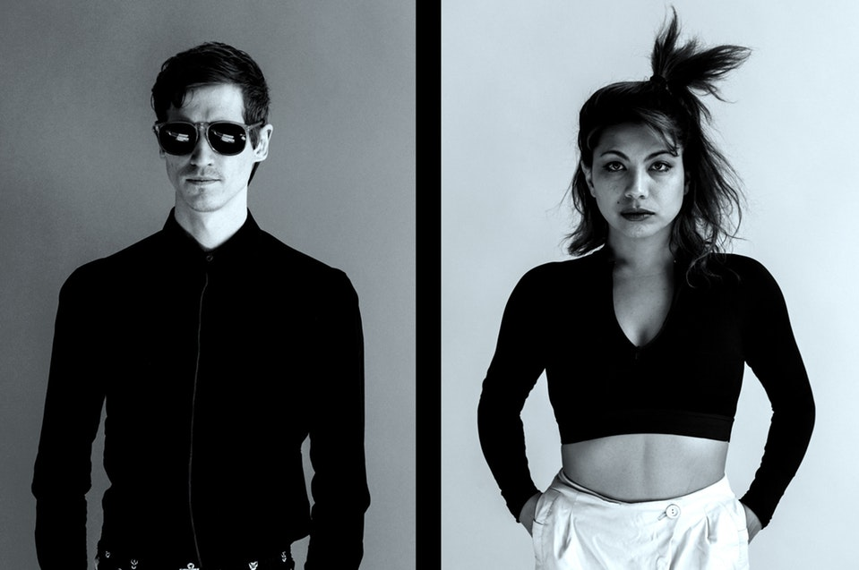

## Opener: Heatwarmer

Sometimes I am pleasantly surprised by openers, and seeing Heatwarmer open for
Knower was one of those times.



I wasn't paying full attention when their set began, but by the end I was
totally captivated.
They do a fantastic job of hitting the right blend of impressive musicianship
and comedy in their music and I can't wait to see them again.

## Knower

This was the first time I saw Knower, and before this show, I hadn't listened
to much of their music, but the show certainly turned me into a devoted fan.



My impression of them from before the show, based on what I had seen online,
was that they just made silly songs for YouTube,
but I quickly learned that there is *way* more to Knower than just silly
songs for YouTube.
Most of their music is genuinely great, and the drum, keyboard, bass,
and sax solos throughout the show had me smiling all the way through.

[event page](http://www.thebarboza.com/event/1482929-knower-seattle/)
