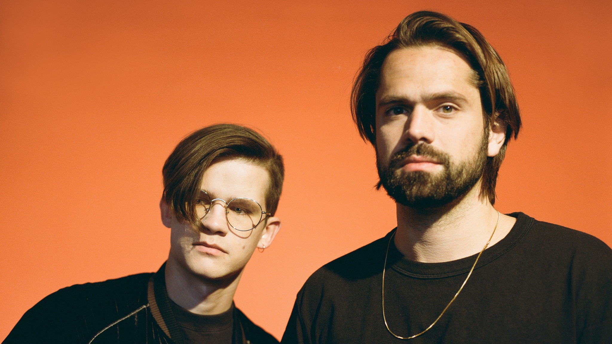

## Opener: Night Lights

I only caught the last couple songs of Night Lights' set.
They sounded not bad, but not really my favorite style of music.



## Lemaitre

I have lots of mixed thoughts on this show.
Overall, it was a fun show and I would recommend seeing them if you enjoy their
music.

I've been a fan of Lemaitre since high school and have wanted to see them
live for a long time, and
[their hype videos](https://www.youtube.com/watch?v=tBd537v7g2A)
make their live show look pretty rad, so I had pretty high expectations for it.

There were a lot of cool things about the show.
The music sounded good, which is important to me.
The stage props and the lights were some of the coolest I've seen at a show
that size, and they did a good job of integrating them with the performance.



Overall though, I was a bit disappointed with it.
My favorite thing about live music is getting to watch people make music, live.
Unfortunately, things like rad lights, music that sounds almost __exactly__
like it does on the record, and looking cool on stage seemed to be higher
priorities at this show than showing musical talent.

Don't get me wrong: I value those things too, and think they are
important, and I love shows that can do those things well,
but they aren't the primary things I go to live music for.
I'm also not saying that Lemaitre doesn't have musical talent; they
most definitely do!
I just felt like they didn't show it on stage as much as I was hoping
they would.

They had half a dozen keyboards and synths on stage, so I was getting
pretty excited while they were setting up,
but despite all the hardware, there was very little actual keyboard playing.
Most of the music was coming from prerecorded tracks and there were only a few
small portions of the show where they played some of the synths when
I could connect sounds that I was hearing with my ears with the instrument
playing that I could see with my eyes.



The best part of the show was this guy:



Officially, Lemaitre is just the two guys in the front,
Ketil and Ulrik, but they bring along other musicians for their live shows,
and this guy is one of those musicians.
He was great.
He mostly played keys, but picked up a guitar for a few solos
at various points throughout the show.
He also grabbed the mic to scream at / hype up the audience (in a good way)
at a few points.
I would **love** to watch a band that he's leading,
if only I can find out who he is.

Overall, I liked the show.
My criticism of it probably sounds more harsh than it is meant to be.
It was a good show as a whole, just not my preferred kind of show.

[event page](https://www.augusthallsf.com/events/2018/12/7/lemaitre)
