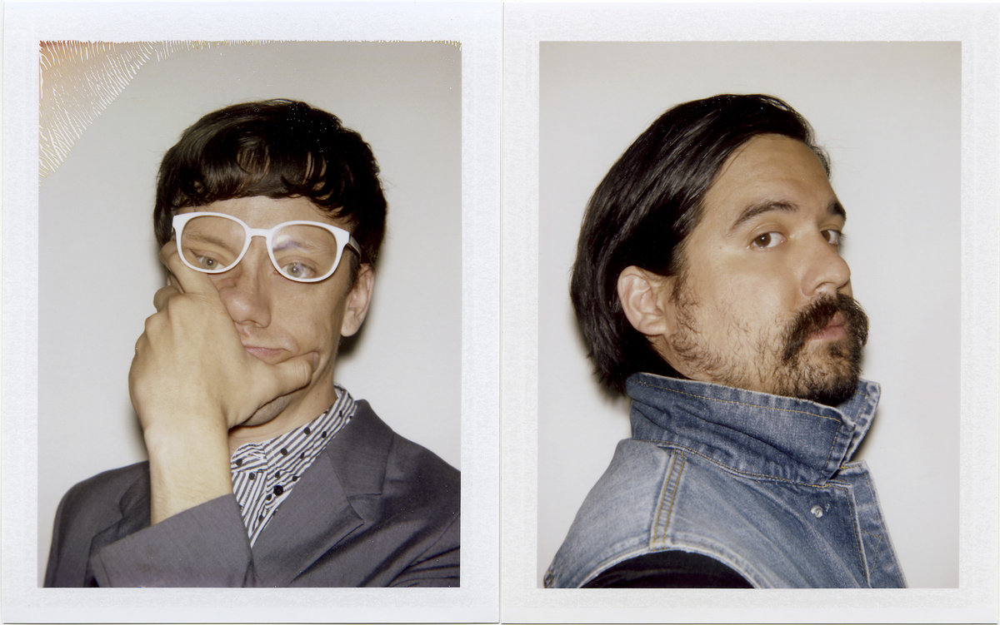
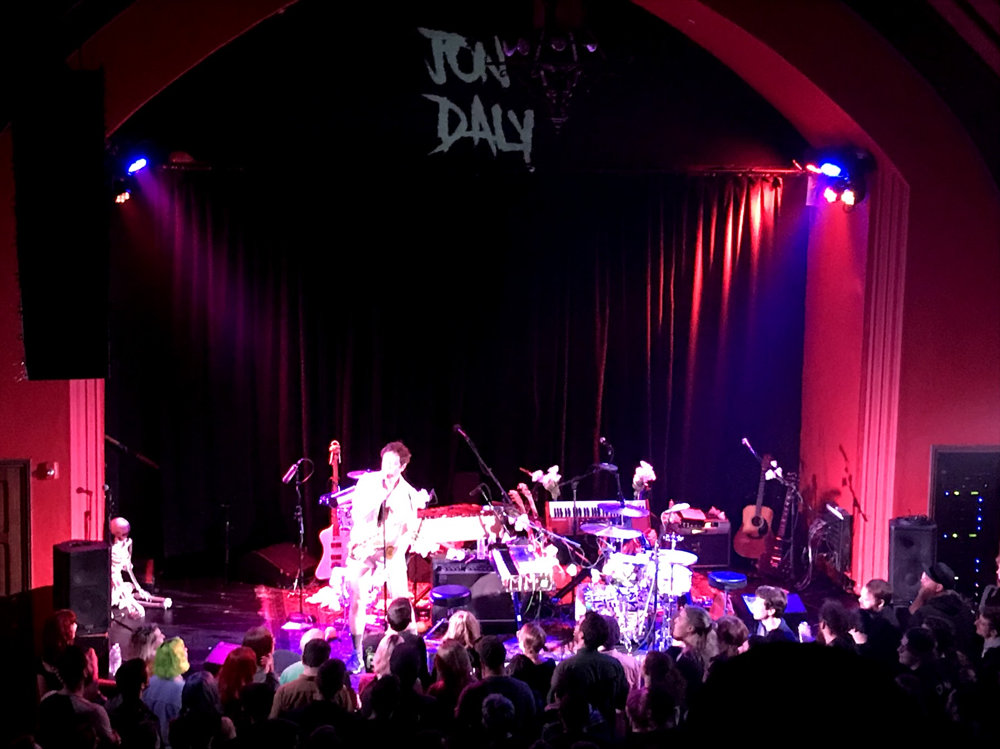
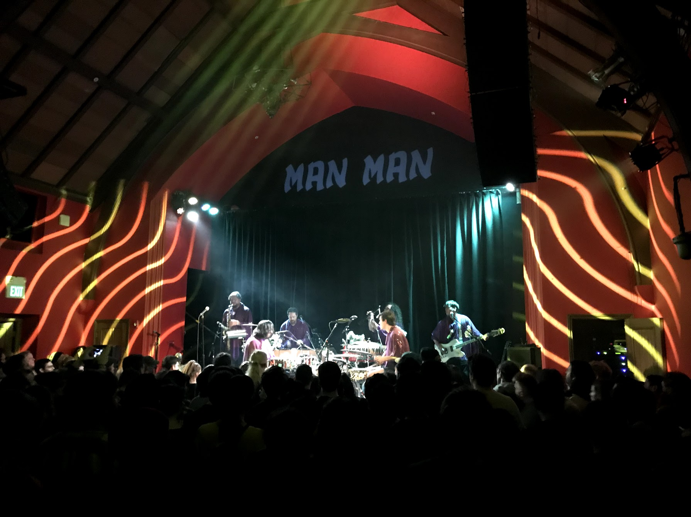
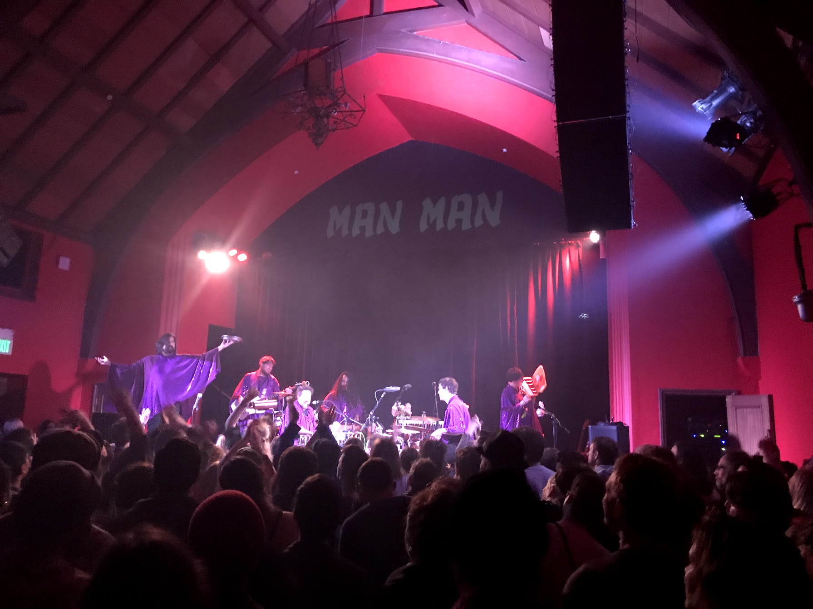
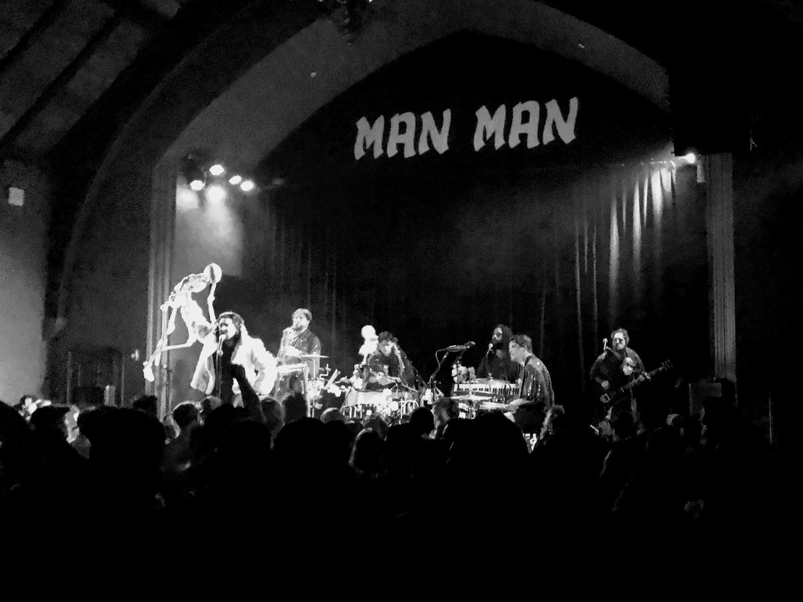

## Opener: The Yahoo Kids

## Opener: Jon Daly

This guy was interesting.

He did a music/comedy performance solo on stage with a saxophone.
Some of his stuff was really funny and some was just uncomfortable,
but that may have been totally intentional.

## Man Man

**This show was so good.**
I've enjoyed Honus Honus' stuff for a while now,
but I definitely underestimated how good this show would be.

The band was six people, all rotating instruments throughout the show,
probably playing close to two dozen different instruments over the course of
the night.
They all wore purple sparkly cloaks and kept up a great energy the whole time.

When I play shows, I want them to be like this was.
It was such a good blend of high enery music,
impressive musicianship,
danceable grooves,
exciting and experimental sonic choices,
and thoughtful and interesting lyrical content.
I loved the costumes.

At one point, Honus Honus was carrying around a skeleton and hurled it into
the crowd and the skeleton crowdsurfed around the room before making its way
back to the stage and eventually ending up on the bass/sax player's head.

[event page](https://www.thechapelsf.com/event/1793623-man-man-san-francisco/)
