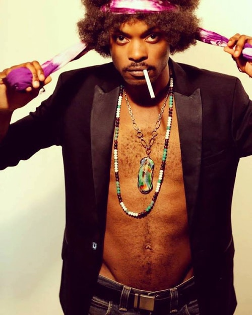

## Opener: Professor Colombo



## Opener: The Family Jules



## Puscie Jones Revue

This show was fun.
I went on a whim since I had just come back from Christmas break and none of my
friends were in town yet.
It was the first concert I went to alone and I had no idea what I was in for.



Puscie Jones is pretty crazy.
His music was high energy and fun, and he went backstage for a costume change
after nearly every song.
