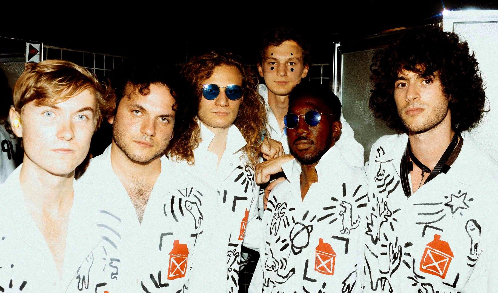

## Opener: Big Butterfly

I love seeing openers.
It can be high risk sometimes: many openers are not great,
but every once in a while one I see a great opener that really catches my
attention and becomes a new favorite for me.
Big Butterfly was one of the good ones.



Zach Ostroff and Scott Amendola's blend of rock, jazz, and psychedelic
improvisations captured my attention from start to finish,
and ended with an amazing cover of Britney Spears' Toxic that was one
of my favorite covers I've ever heard.

It's hard to find much of their music online, but I heard a rumor that
there will be an official release in the (hopefully near) future.

## Thumpasaurus

Speaking of great openers, I actually first heard Thumpasaurus when
they opened for [Knower at the Lodge Room in LA](/concerts/knower-2) last year.
Since then, they have become one of my favorite bands to see live.
They put on a ridiculously fun show and display a brilliant blend of humor
and skillful musicianship that made them a perfect match for Knower.

This show was similar to their
[album release show at Troubadour in LA](/concerts/thumpasaurus-2),
with a few minor tweaks.



This one opened up with a comical video about Mark Zuckerberg, Jeff Bezos,
and Elon Musk taking over the world,
feeding straight in to the opening song,
which instantly got the audience dancing.

Thumpasaurus' music is pretty far out there, and might not be for everyone,
but it's hard to imagine that anyone could see them perform and not
have a great time.

[event page](https://www.thechapelsf.com/event/1772989-thumpasaurus-san-francisco/)
