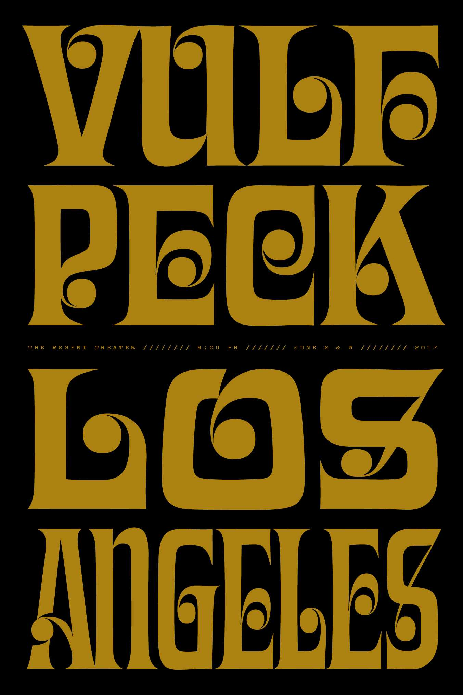

## Opener: Jacob Mann Big Band

Jacob Mann Big Band was amazing and I've since become a big fan.



He has some great music on
[bandcamp](https://jacobmann.bandcamp.com/album/greatest-hits-volume-1)
and
[spotify](https://open.spotify.com/album/2aGGRksxFCcZMrNAy0aptE?si=P8nCwy8jSbiUyWyRQYMeNw).

## Opener: Joey Dosik

Joey Dosik was fantasic, as always.

## Vulfpeck

In the few years leading up to this show,
Vulfpeck had become my favorite band and I was beyond stoked to see them
and this show didn't disappoint at all.



Highlights included the Beastly solo and
[Dana Wilson](https://www.instagram.com/danadaners/)'s Funky Duck dance.

[event page](https://www.facebook.com/events/1176466205771389/)
