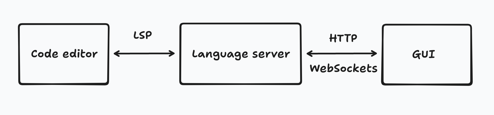

I built a small proof-of-concept for a system that enables real-time
bidirectional editing between any modern code editor and a GUI, enabled by an
LSP[^1] server.

# Code-based CAD

I like working on small projects at home that benefit from CAD. I'm also a
programmer with a personal development environment that I've spent years making
as cozy as possible. Naturally I've been interested in finding code-based CAD
system to use for my projects that allows me to use that cozy development
environment.

I read [a recent update from Kevin Lynagh about his ongoing work on
codeCAD](https://kevinlynagh.com/newsletter/2025_06_03_prototyping_a_language/),
and this part on bidirectional editing stood out to me (emphasis mine):

<blockquote id="quote">
For example: One idea I’m exploring is “bidirectional editing”, so geometry can
be manipulated using either:

- a purpose-built graphical UI, or
- the textual codeCAD language

If you graphically drag a point around, the coordinates in the source code
should automatically update.
If you edit the source code, the graphical UI should automatically update.

A simple way to test this idea is to throw a `<textarea>` in the UI that
displays the corresponding source code.
But to me, that feels terrible because I never want to be coding in some janky,
in-browser `<textarea>` — I want to be working with source code in Emacs, with
all of my familiar key bindings, color schemes, autocomplete, and decades of
cozy practice.

**That’s the core appeal of a textual programming language.**

But doing this properly is an absolute boatload of work:

- How does the system rewrite source code? Is it mediated by files on disk with
  reload on save? How do the editor and UI stay in sync and avoid clobbering
  each other’s unsaved changes? **Maybe we need an LSP server?**
- The language interpreter needs to preserve comments and flow them through,
  even when the UI makes edits to the code.
- What about whitespace / pretty-printing?

How much of this needs to be built to evaluate whether bidirectional editing
“fits nicely in the hand”?
</blockquote>

In particular:

> Maybe we need an LSP server?

I've been a happy user of LSP servers since they became commonplace in Neovim
setups[^2], but I have almost no experience with language server internals.
I had certainly never considered that they could facilitate bidirectional
editing with a GUI.

# A proof-of-concept

That line from Kevin's post was a proper nerd-snipe because a few hours later I
had built this proof-of-concept:

What you're seeing here is a text editor next to a GUI, and data live-updating
both ways between them, made possible by a small server that uses LSP to
communicate with the text editor and WebSockets to communicate with a web app.

I've shared more technical details and the code for this demo [here on
GitHub](https://github.com/jamesbvaughan/bidirectional-number-editor).

# Why this excites me

Bidirectional editing isn't new.
What's new, as far as I'm aware, is real-time bidirectional editing _that works
with your favorite text editor._

I've tried out a handful of code-based CAD systems, but so far I haven't found
any that achieve more than two out of these three features:

- Real-time-ish updates in the GUI from changes made in the code
- Real-time-ish updates in the code from changes made in the GUI
- Works well with my preferred code editor

[Fusion 360](https://www.autodesk.com/products/fusion-360/overview#top) has
decent bidirectional editing for parameters, but it's not fully code-based and
it certainly doesn't let me use my own editor.

[OpenSCAD](https://openscad.org/) doesn't require the use of its own text
editor, and it's possible to trigger reloads in the GUI via file watching
when you save source files in external editors, but it only goes one way.

[Zoo](https://zoo.dev/design-studio) has some bidirectional editing, but only
with its built-in editor.

[Arcol](https://www.arcol.io/), the tool that I help build at my day job[^3], is
innovating in CAD interface design in some exciting ways, but we're building for
architects, not programmers.

This is just a toy demo, but it's enough to excite me about the possibility of a
system that achieves _all three_ of those points!

# What's next

I don't plan to develop this demo further, at least not anytime soon, but I hope
it inspires people to find more creative uses (abuses?) of LSP servers.

One of the best code-CAD environments I've worked in is OpenSCAD + Neovim with
the [OpenSCAD LSP server](https://github.com/Leathong/openscad-LSP), only using
the OpenSCAD GUI for the viewer, not the built-in text editor.
OpenSCAD is fundamentally not built for GUI editing, but since it's open source
and has a nice language server already, it could be a good place to develop a
more interesting demo of this concept.

Like Kevin's post said, doing this properly will be a boatload of work.
Handling conflict resolution, incremental edits, and the more complex general
LSP server internals are all serious tasks, let alone creating a whole new
language for CAD.

I'm looking forward to seeing what Kevin comes up with for codeCAD!

[^1]: _LSP_ is the [Language Server Protocol](https://microsoft.github.io/language-server-protocol/).
It's used by language servers to provide features like diagnostics, code
actions, go-to-definition, and autocomplete suggestions in text editors and
IDEs.

[^2]: [the LSP bits](https://github.com/jamesbvaughan/dotfiles/blob/main/common/neovim/.config/nvim/lua/plugins/lspconfig.lua)
of my config have grown and shrunk and grown again over the years.

[^3]: It's an exciting time at Arcol right now! After building for a few years,
we've finally launched the tool publicly and we're hiring programmers. If
you're interested in working with us just learning more, reach out at
james@arcol.io.
