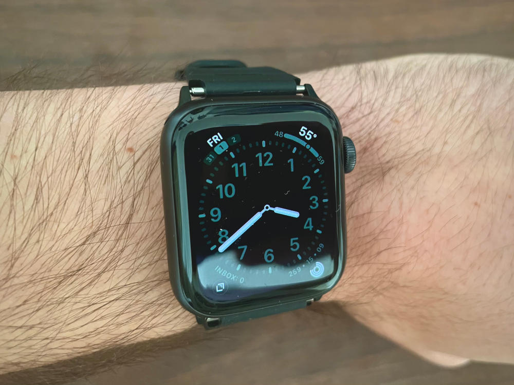

I love the Casio F-91W.
After getting one in high school, I wore it all through college and continued to until upgrading to an Apple Watch earlier this year.
I love the Apple Watch too, but often miss the feel and the simplicity of the Casio.

In order to get a bit of that feel back, I decided to put the band from the Casio on my Apple Watch.
I figured that there would be plenty of examples of people doing this online given the popularity of the F-91W.
To  my surprise though, I couldn’t find anything at all about people doing this, so I decided to do it myself and post this for anyone else who has the same idea.

I don’t know a lot about watches, but I learned that a lot of watch bands seem to use a somewhat standard mechanism that you can get Apple Watch adapter for.

I picked up a set of these adapters on Amazon.
(There are dozens on there. [This](https://smile.amazon.com/gp/product/B076S3TVBX) is the one I went with but as far as I can tell they’re all pretty much identical.)
I tried attaching my Casio bands to them, but the pins included with the adapter were about twice the diameter of the holes on the bands.
This was a bit discouraging, but after stretching the holes a bit with a drill, I was able to fit the pins in just fine.

These were the most narrow of the adapters that I could find, but as you can see they're still a few millimeters too wide.
I may try doing something to clean that up in the future, but for now these are working great! 
