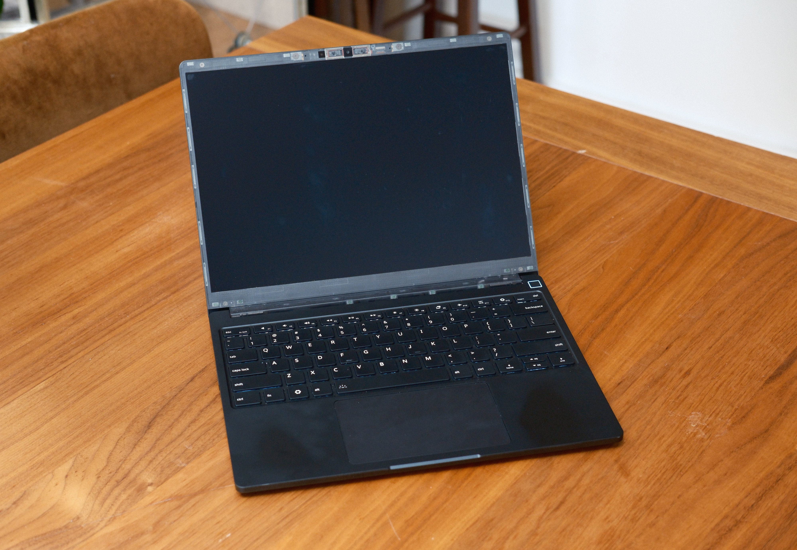
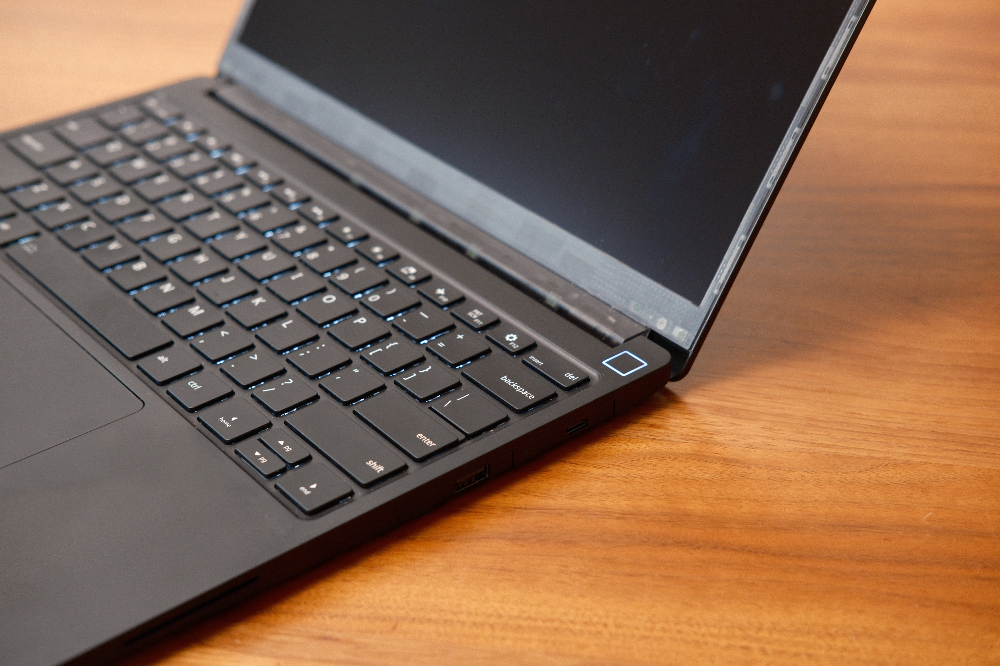
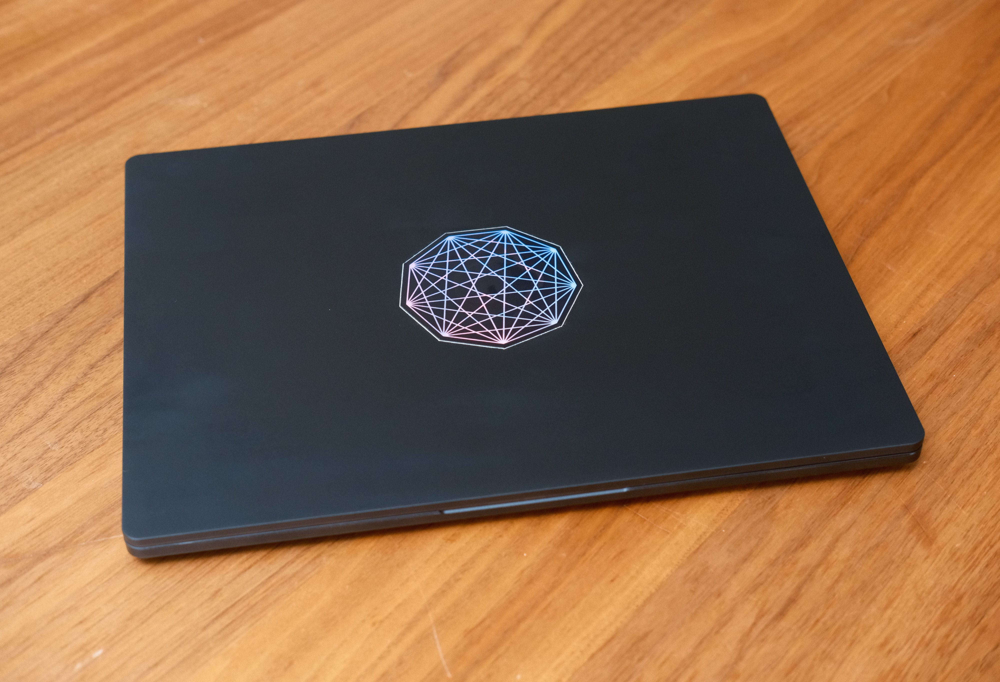
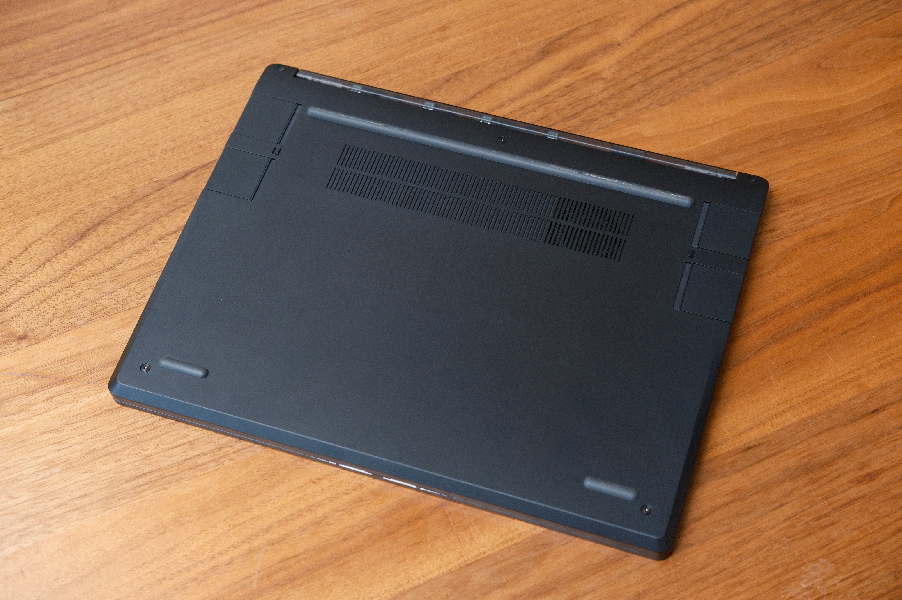
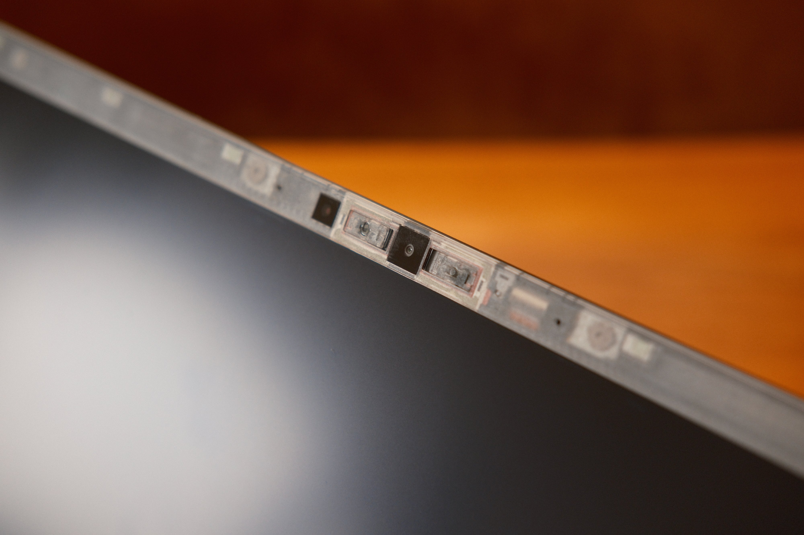

I purchased Framework's new [Laptop 13 Pro](https://frame.work/laptop13pro)
recently.
These are my initial impressions of it, and of switching back to Arch Linux
after a few years on macOS.

I've been bouncing between macOS and Linux for the last 12 years, never fully
satisfied with either.
On Mac, I'm constantly missing the window management from [sway](https://swaywm.org/) and the ability to customize ~everything about my environment.
On Linux, I miss [Continuity](https://www.apple.com/macos/continuity/) and the MacBook's hardware.

## The Framework Laptop

I've been following Framework and rooting for them for years, but never
purchased any of their computers because none of them felt quite right for me.
The 12 and 13 didn't seem like they could stack up against the MacBook Pro in
physical quality, CPU power, and battery life.
The 16 could get closer in terms of performance, but I don't want a laptop that
big.
The desktop is neat, but if I wanted a desktop I'd probably build something
fully custom rather than starting with theirs.

This new 13 Pro seemed like the sweet spot: powerful enough to compete with a
MacBook Pro, better hardware than the regular 13, and strong Linux support
explicitly prioritized by the manufacturer.

I'm only a few weeks into using this laptop, but I'm really pleased so far.
The hardware feels and looks great.
It's not quite as _solid_ as a MacBook; there are more visible seams and a bit
more flex, but to me that's a totally acceptable
trade-off for the repairability and upgradeability.

There are a few hardware improvements that I'm hoping for in the future:
- A keyboard with ThinkPad-style keys and a TrackPoint.
  The included keyboard isn't bad, but I prefer the feel of ThinkPad caps and
  switches, and I miss the TrackPoint from my old ThinkPad.
- An OLED display for deeper black levels.
- A better webcam. Coming from Apple's laptop cameras, the Framework's is bad.

## Linux

I used Linux full time in college, but had to use a Mac for my first job after
graduating.
Since then, I've only sunk deeper into the Apple ecosystem, and I've missed
things about it each time I've attempted to switch back to Linux.

This could be another short-lived attempt, but I'm optimistic that it's going to
stick this time.
There are two big reasons:

- This laptop is great and it doesn't feel like a downgrade from a MacBook.
- Coding agents have completely changed what it's like to configure an Arch Linux system.

I'm no stranger to complex and custom Arch setups and ricing in general.
I have 11 years of commit history in my dotfiles repo, evidence of way more hours than
I'd like to admit spent tweaking little details of my environment, but
with a coding agent (lately it's been Gemini 3.6 Flash inside [Pi](https://pi.dev/)), system and application configuration has become much less of a time-sink.

I mostly try to limit actual edits to files tracked in my dotfiles git repo, but
even without actual file edits, the agents are incredibly helpful when debugging
system issues.
Recently they've helped me debug issues with external displays, printers,
and networks.
Many of those things would be non-issues if I used a distro like Ubuntu or
Fedora that has most things configured nicely out of the box, but I enjoy doing
a bit of work up front to get all of those things working exactly how I want
them to.

I've never tried using NixOS, but that may be my next adventure.
I suspect that its immutable design and the ability to track all system changes
in git could be an excellent fit for agent-assisted system configuration.

My goal for this run with Linux is to have as few compromises as possible when
it comes to things I miss from macOS.
Anytime I notice myself wishing I could do something that was possible on the
Mac, rather than finding a quick or hacky workaround, I'm taking the time to set
up a proper replacement.
Often, the replacement feels more like an improvement than a compromise!

The main things still missing are:
- **iCloud Photos** - I use the Photos app on Mac all the time to quickly get photos
  that I took on my phone or import photos from an SD card. For now I'm trying
  out the iCloud Photos web app and using Google Photos more. I'm aware of
  [immich](https://immich.app/) but I'm not sure whether I trust myself or
  Google/Apple to keep the relevant infrastructure running for the rest of my life.
- **iMessage/SMS sync** - I've seen some hacky solutions for this, but none seem
  stable enough to be worth it for me.
- **Continuity clipboard sync** - I can get by with
  [LocalSend](https://localsend.org/), but it's not frictionless enough to feel
  like a full replacement.
- **Ableton Live** - I know about [Bitwig](https://www.bitwig.com/) and will try
  it one day, but I really like Ableton and wish it had official Linux support.

For the other nerds reading this who like this kind of thing, here's my current
stack:
- [Arch](https://archlinux.org/)
- [Sway](https://swaywm.org/)
- [Waybar](https://github.com/Alexays/Waybar)
- [Ghostty](https://ghostty.org/)
- [tmux](https://github.com/tmux/tmux/wiki)
- [Neovim](https://neovim.io/)
- Google Chrome (mainly for cross-device sync linked to my Google account, although I may end up [back on qutebrowser](https://jamesbvaughan.com/qutebrowser/) soon if I find I can live without sync)

Some nice Linux alternatives to Mac-only software that I'm using:
- [Vicinae](https://github.com/vicinaehq/vicinae) (replaces [Raycast](https://www.raycast.com/))
- [Kooha](https://github.com/seadve/kooha) (replaces [Gifox](https://gifox.app/))

If you have any questions or suggestions, please [email me](mailto:james@jamesbvaughan.com).
