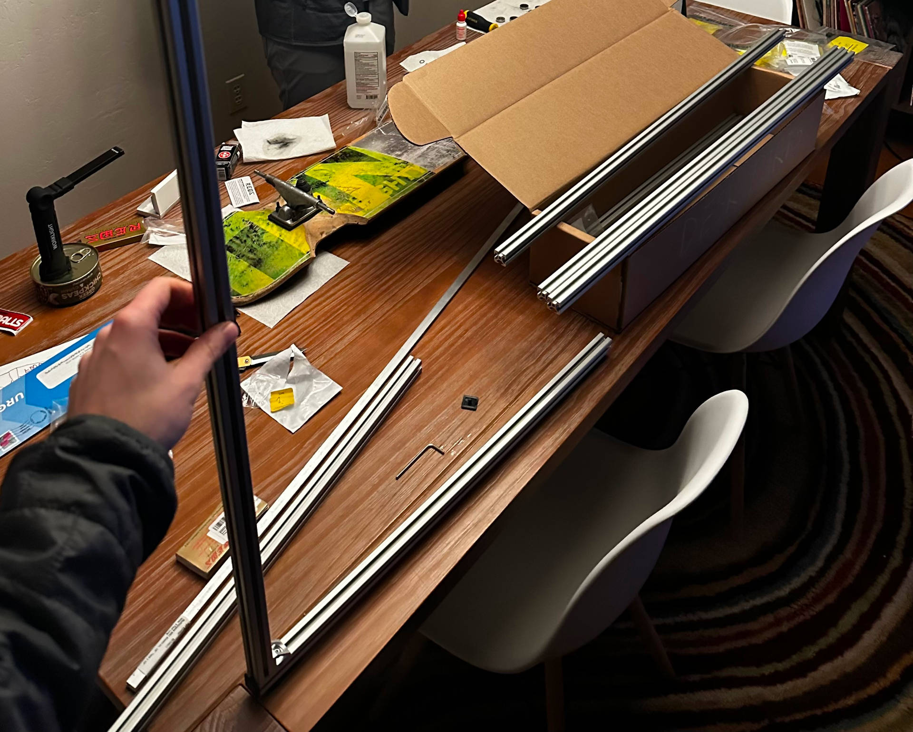

I recently completed the first version of a new work desk that I'm designing and building, inspired by [Teenage Engineering's Field Desk](https://teenage.engineering/products/field-desk), along with [a website where you can configure your own and get links to purchase the materials and hardware needed to build it](https://tweenage.engineering/meadow-desk/configure).

I call it the Meadow Desk.
This post describes the inspiration for that project, the process of working on it, and its current status.

## Inspiration

As a fan of Teenage Engineering, I was excited to see an email from their mailing list a few weeks ago announcing a new product release.
I was surprised to see that the new product was a desk, but also intrigued and curious to see what their spin on a typical work desk would be.

After reading through their marketing page, I was into the design generally, but not into the $1599 price tag for a desk with no height adjustment and a 165 lb max load.

Commenters on Hacker News were even more put off by the price. Here's a line from [the top comment](https://news.ycombinator.com/item?id=34713115):

> I mean $1600 USD for a few bits of aluminum and a piece of plywood?! This thing would be overpriced relative to manufacturing costs if it cost $160, yet Teenage Engineering have slapped an entire extra digit onto the end of the price.

After reading more comments like that, and having recently binged [Steven Bennett's excellent series of build logs documenting his attempt to recreate Dyson's $600 task light](https://youtube.com/playlist?list=PL0szyq6FLzZi2BB8-iA09LrTv0rd4K04u&si=EnSIkaIECMiOmarE), I decided to try my own product recreation and build a desk inspired by the Field Desk.

The desk is far less complicated from an engineering perspective than the task light that Steven is building, but I'm far less experienced with product design and furniture building, so the desk project idea felt similarly exciting to me.

## Planning

Before purchasing parts and trying to put them together, I wanted to sketch out my ideas and make sure they actually made sense in terms of cost and construction feasibility.
This process involved watching a lot of Fusion 360 tutorials (another exciting thing about this project was that it gave me the motivation I've wanted to finally learn Fusion) and hours of exploring McMaster-Carr's online catalog.

Eventually, I fumbled through Fusion enough to get a decent looking design put together and rendered well enough to give me a sense of what the desk would look like:

## Construction

After iterating on the design a bit and narrowing down the hardware to a handful of potential options, I submitted my order from McMaster.
A couple days later, I had some t-slot rails and a variety of fasteners and brackets to play with.

I compared the different hardware options on price, structural stability, and aesthetics, eventually deciding on some rail nuts and gussets to use for the initial build.

The actual construction was really simple with the t-slot rails.
The parts that I chose all work together out of the box, and the only machining I did was to cut and drill holes in the aluminum bars that I used for the rear crossbars.

## Website

One goal with this project was to build myself a cool desk, but the more exciting goal to me was to make it possible and easy for other people to do the same.

For that, I've created [a website](https://tweenage.engineering) with [a configuration tool](https://tweenage.engineering/meadow-desk/configure) where you can play with different designs for a Meadow Desk of their own, along with a table listing the parts you'll need with a view of their cost updating in real time as you modify the desk's properties.

I have a lot of ideas for the website that I haven't had time to implement yet (a dynamically-generated build guide based on your chosen desk parameters, more complex logic for providing price estimates, a way to compare different hardware options for the fasteners and brackets, etc.), but I'm really proud of what I've done with it so far.
I hope that it inspires someone else to use it to plan and build their own desk.
(If this project helps you build a desk, please [let me know](mailto:james@jamesbvaughan.com)!)

## Next steps

Like I just mentioned, I have some ideas for making the website more useful, but I also want to improve the desk design itself.
This first version I've built is great for a start, but there are some specific things I'd like to make better:

- I still haven't decided on a way to fasten the desktop to the t-slot that I'm really happy with. I'd like the hardware to be concealed, but not too difficult to remove. My current solution technically meets those requirements, but it's not as strong as I'd like.
- There is some wobble at the front of the desk that I want to eliminate. The crossbars at the rear do an excellent job of stabilizing that side, but I want to keep the front open.
- If I put a computer on the desk, I want at least some cable management features for keeping the underside looking tidy. I could do this with a pre-built cable-management tray that would mount to the bottom of the desktop, but I want to explore different solutions that would take advantage of the modular nature of the t-slot and match the aesthetic of the rest of the desk.
- I built this first version using 20mm rails, partially to try to stick to the original design, and partially to cut costs, but my mechanical engineer roommate convinced me that it would be worth upgrading to 1" rails, and in retrospect it seems like the obvious correct choice: It's not that much more expensive, it's stronger, and I could stop mixing unit systems in my models.
