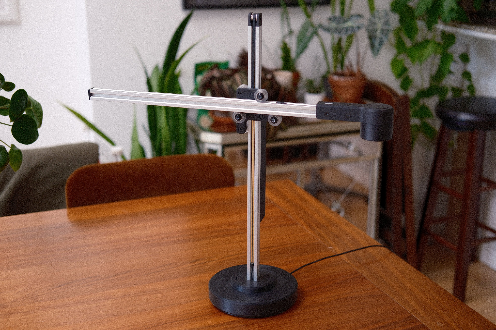
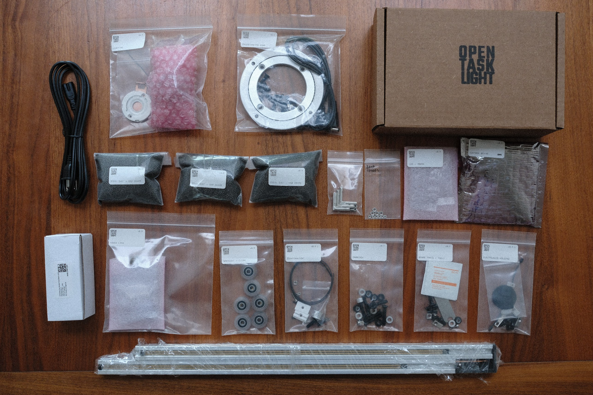
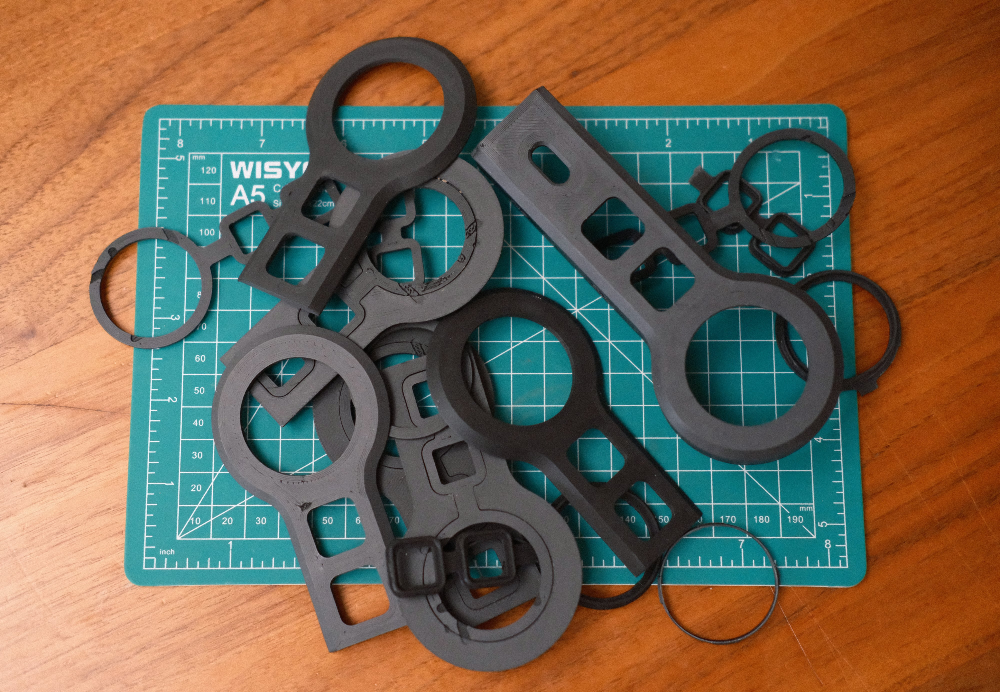
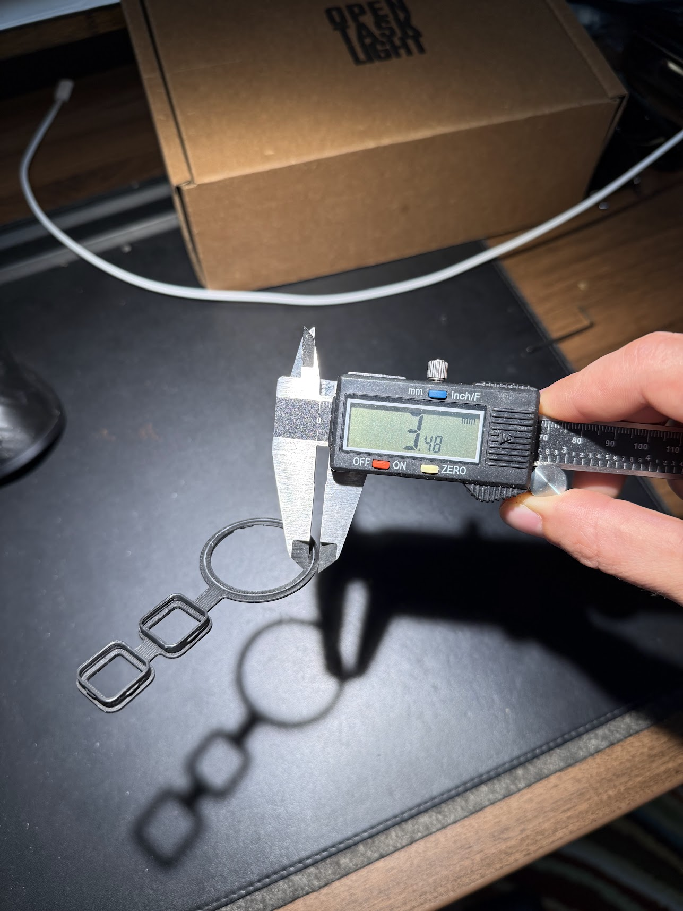
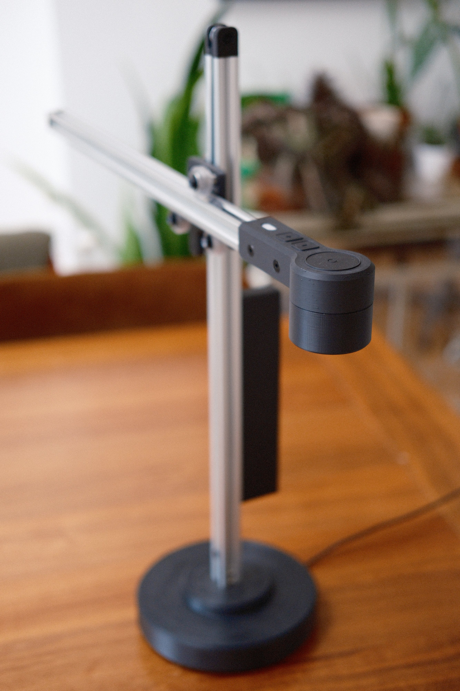
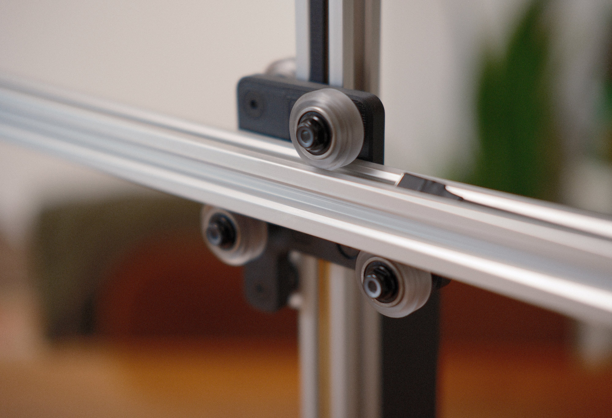
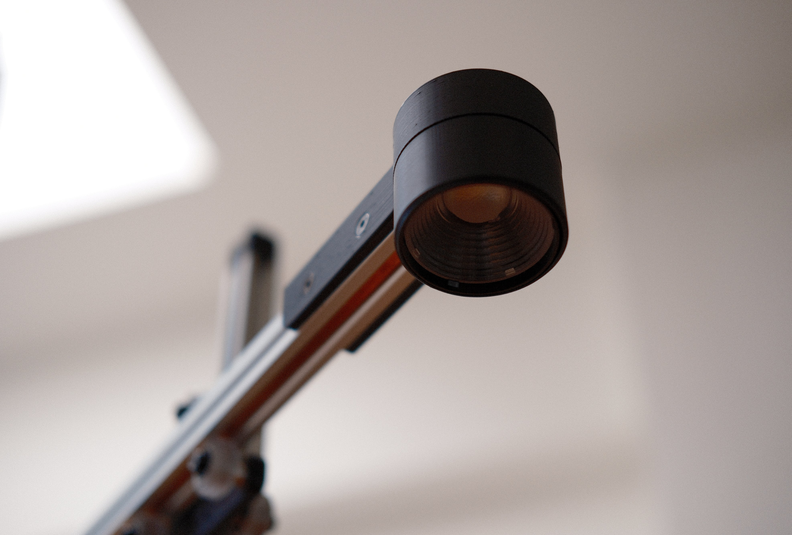
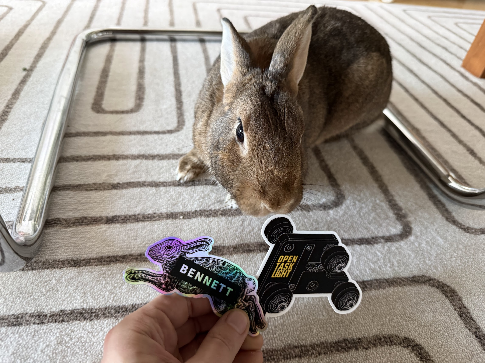

Steven Bennett just launched the [Open Task Light](https://opentasklight.com) build kit after four years of publicly documenting his work on it.
Today's [launch video](https://www.youtube.com/watch?v=ipVFRH6TQfM) includes a good summary of the project.
In recent months, I've been helping beta test the kit and the [build documentation](https://open-task-light.gitbook.io/open-task-light).
In this post I'll share my experience with it.

_Disclaimer: I wasn't asked to write this, I paid for my beta kit, and I don't
have any financial stake in the kit sales._

## DIYson / Open Task Light project background

About four years ago, Steven Bennett started [publicly documenting](https://www.youtube.com/playlist?list=PL0szyq6FLzZi2BB8-iA09LrTv0rd4K04u) his project to create a task light inspired by Dyson's [Lightcycle](https://www.dyson.com/lighting/lightcycle) task light.
YouTube's recommendation system suggested Steven's first video to me shortly after he posted it, and I've enjoyed following the project video logs since then.

Steven set some ambitious goals for the project. His lamp needed to:

- feature a similar positioning mechanism to the Dyson light
- use an LED similar to the Dyson lamp's in quality (high CRI) and output power
- be relatively easy to assemble with off-the-shelf and 3D printed parts

Achieving all of those goals turned out to be a challenge that grew to fill years of iteration.
I won't try to summarize that work any further because [Steven's videos](https://www.youtube.com/playlist?list=PL0szyq6FLzZi2BB8-iA09LrTv0rd4K04u) are excellent on their own.
They really made me appreciate the amount of design and engineering work that it takes to make something like this, both Steven's work and that of the designers and engineers at Dyson who created the original.

## Beta testing the kit

Over the past few months, a handful of supporters of the project have been helping beta test the build kits.

By the time I joined, the 3D print files and build guide were already pretty polished, but there were a few specific parts that still had quite a bit of iteration ahead of them.

Many of the printed parts are meant to fit together with extremely tight
tolerances, and subtle differences between slicers and printers meant that a
perfectly snug fit for one tester could be an impossible fit for a different tester.

Steven worked with the beta testers to find solutions to these print and fit
issues.
One or more of us would report an issue with some part, and he (or one of the
other testers) would tweak the design a bit, print parts for testing,
and have other testers print the updated designs to
validate the changes against a variety of printers, slicers, and filaments.
The results of that process are in the print files and suggested slicer settings
in the build documentation's [printing
guide](https://open-task-light.gitbook.io/open-task-light/printing-guide).

The whole build took me about a week, kicking off prints overnight and while I
was at work, and assembling in the evenings.
If you printed all the parts ahead of time, you could probably complete the
build the same day you receive all of the non-printed parts if you really rush
through it.

## Thoughts on the lamp itself

I love this thing.
I had been wanting a task light that was easy to position, dimmable, and used a
high CRI LED.
I almost bought an Anglepoise
[1227](https://www.anglepoise.com/product/original-1227-desk-lamp-jet-black/) or
[Type 75](https://www.anglepoise.com/product/type-75-desk-lamp-jet-black/), but
the OTL is closer to what I was hoping to find, and the timing worked out well
for me to build one.

The positioning mechanism is really nice to use and works perfectly for me.
The light stays wherever I put it, and it has enough range to stay out of the
way when I don't need it.

It gets _really_ bright.
The max brightness has been too bright for anything I've used the lamp for so
far, but the dimming works well, and the default firmware has the dimmer level
persist across restarts.

One DIY upgrade I'd like to see for this is a battery integrated into the
freestanding base.
I frequently move projects between my computer desk and my kitchen table, and it
would be great to be able to bring the lamp along without needing to move the
power supply.

## More photos of my build

A close-up shot of the carriage, which joins the two rails and houses the power link.

The horizontal rail and LED housing from below.
Here you can see the heat pipe that's integrated into the rail,
which helps prevent the crazy LED's heat from melting the plastic housing.

Levee approves of the stickers.

Thanks for reading, and check out Steven's launch video [here](https://www.youtube.com/watch?v=ipVFRH6TQfM) if you haven't yet.
