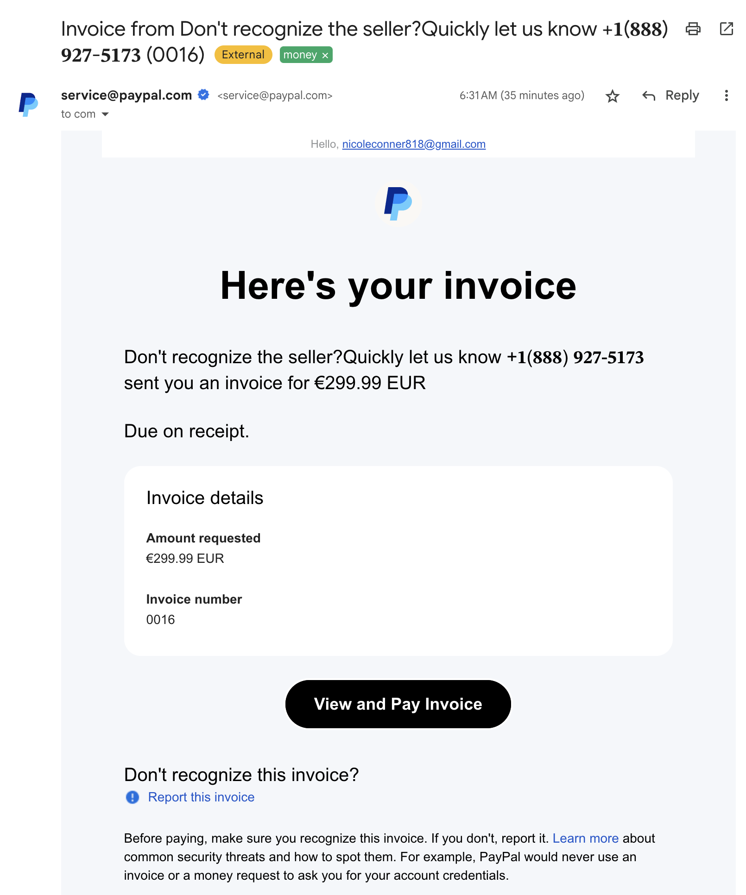
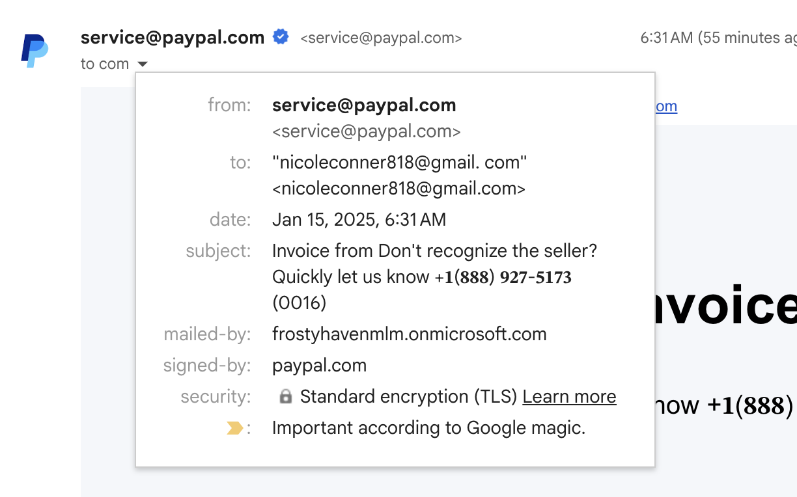

I received a surprising scammy email today, and I ended up learning some things
about email security as a result.

Here's the email:

I was about to mark it as spam in Gmail and move on, but I noticed a couple
things that intrigued me.

At first glance, this appeared to be a legitimate PayPal invoice email.
It looked like someone set their seller name to be "Don't recognize the
seller?Quickly let us know +1(888) XXX-XXXX", but with non-ASCII numerals,
probably to avoid some automated spam detection.

But then I noticed that the email's "to" address was not mine, and I did not
recognize it.

This left me pretty confused, wondering:
- How did it end up in my inbox?
- How is there a legitimate looking "`signed-by`: paypal.com" field in Gmail's
  UI?
- Why didn't Gmail catch this as spam?
- If this is a real PayPal invoice and they have my email address, why didn't
  they send it to me directly?

# What's going on here?

## How did this end up in my inbox and how was it signed by PayPal?

After downloading the message and reading through the headers, I believe I
understand how it ended up in my inbox.

The scammer owns at least three relevant things here:
- The email address in the `to` field
- The domain in the `mailed-by` field
- A PayPal account with the name set to "Don't recognize the seller?Quickly let
  us know +1(888) XXX-XXXX"

I believe they sent themselves a PayPal invoice, and then crafted an email to
send me using that email's body.
They had to leave the body completely unmodified so that they could still
include headers that would show that it's been signed by PayPal, but they were
still able to modify the delivery address to get it sent to me.

## Why didn't Gmail catch this and mark it as spam?

If that's correct, it explains how it ended up in my inbox and why it appears to
have been legitimately signed by PayPal, but I still believe Gmail should have
caught this.

I would have expected that for a service as significant as PayPal, Gmail would
have at minimum a hard-coded rule that marks emails as spam if they're signed by
PayPal, but mailed by an unrecognized domain.

Fortunately, PayPal seems to be doing what they can to mitigate the risk here
by:
- Trying to prevent seller names from including phone numbers, although this
  email is evidence that they could be doing more here and should prevent more
  creative ways to sneak phone numbers into names.
- Including the invoicee's email address at the top of the body of the email.
  This was the first thing that tipped me off that something interesting was
  going on here.

## Why didn't the scammer send the invoice to me directly?

I suspect that they didn't send the invoice to my email address directly so that
it wouldn't show up in my actual PayPal account, where I'd likely have more
tools to identify it as a scam and report it to PayPal more easily.
