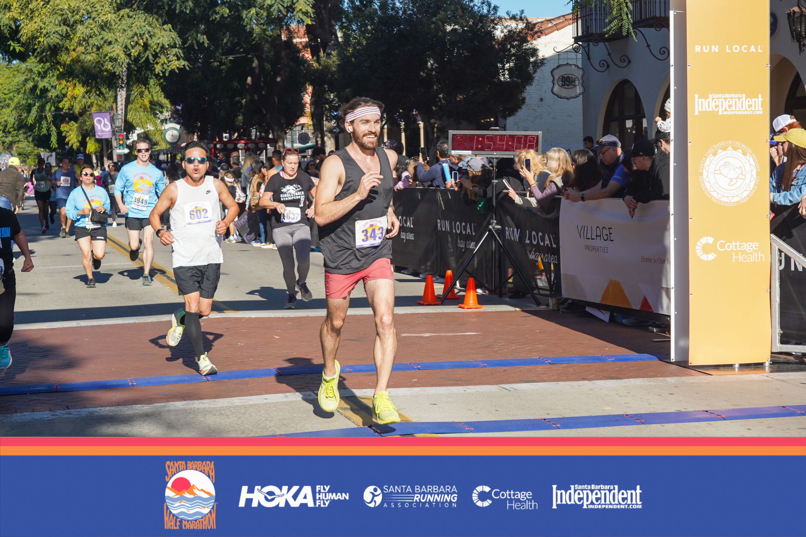

I wasn't much of a runner growing up, but over the past couple years I've begun to really enjoy it.
Last year, I trained for and ran a half marathon and a handful of shorter races, finishing with times that I was pretty happy with!

Having a race to look forward to and train for helps motivate me to run more frequently and to run longer distances.
I've found that when I don't have a race coming up, I'm much more likely to skip days or cut my runs short.

Because of that, I've been interested in finding other ways to stay motivated, and I think that's why I found [Tom Murphy's movie about his project to run the length of every street in his home town of Pittsburgh](https://www.youtube.com/watch?v=1c8i5SABqwU) so inspiring.

At the end of the movie, he encourages viewers to take on the same challenge in their own cities, so that's what I'm doing!
I live in Albany, California, which is way smaller than Pittsburgh, but I'm way less extreme of a runner than Tom, so I think Albany is a proportionally reasonable goal for me.

I've started documenting my progress on this Felt map:



Like I said, it's a lot smaller than Pittsburgh, but if I finish this and am feeling strong, I may bump my goal up to something more ambitious.

My current method for recording and processing the data is:

1. Track the run using the Apple Fitness watch app. I like tracking with the Fitness app rather than Strava because it seems to record a superset of the data that Strava records, and the auto-import into Strava has always worked perfectly for me.
2. Export the `.gpx` file from Strava.
3. Import that file in Felt.
4. Clean up the data a bit. I've described my process for that in a note that's embedded directly into the map so that it's right there when I need to remind myself what to do.

If you're reading this and have any tips related to the running or the data collection and processing, [let me know](mailto:james@jamesbvaughan.com)!
