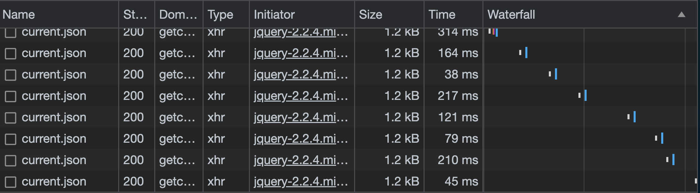

I spent a recent flight finding out what I could do with an connection to the flight's wifi, but without access to the internet.


I was on my way home from Strange Loop, on a flight from St. Louis to Oakland.
It's a long enough flight that I planned to purchase the $8 internet access and get some work done, but Southwest's wifi portal wouldn't accept any form of payment.
The web page didn't give me any helpful error messages, so I opened up my browser's network dev tools to see if I could figure out what was going wrong.

I found the failing request, but it didn't provide any useful hints to point me toward a solution.
While I was there, I saw another request that caught my eye: A repeating successful request for `current.json`.



Here's an example response from one of those requests:

```json
{
  "sat_commlink_portal": {
    "status": "conn_ok",
    "time": "Sun Sep 24 22:02:19 2023"
  },
  "pcent_flt_complete": 33,
  "altVal": "35998",
  "lon": "-100.755",
  "satcomm_status": {
    "commlink": "active",
    "linkparams": "not-stale"
  },
  "dtzone": "PDT",
  "within_us": true,
  "etad": "06:19 PM",
  "lat": "40.201",
  "gspdVal": "487",
  "ttgc": "2h 25m",
  "dist_remain": "1167",
  "actime24": "15:54"
}
```

This appeared to be the data that drives the in-flight wifi portal's flight status page.
Since this was one of the only things I could access on this network, I decided to make the most of it.

I used my browser's "Copy as cURL" feature to quickly get a command to hit the endpoint.
As an aside, this is a really handy feature if you ever need to reply requests made by your browser and want to send all the same headers.


After some experimenting, I found that none of the cookies or headers that were included in the request were strictly necessary, meaning that I could fetch the data with a simple `curl 'https://getconnected.southwestwifi.com/current.json'`.
I set up a loop to dump the data in a log file:

```bash
watch -n 30 "curl https://getconnected.southwestwifi.com/current.json | jq -c >> flight-logs"
```

I didn't know what I'd do with the data at this point, but I started collecting it right away so that I'd have as much as possible to play with later.

With that running, I decided to look more closely at the responses to figure out what exactly I had to work with.
Here's that same example response, annotated with my best guess at what the fields represent:

```json
{
  // This looks like info about the system's satellite internet connection.
  "sat_commlink_portal": {
    // The connection is okay!
    "status": "conn_ok",
    // I'm not sure what this time is.
    // It hasn't changed at all.
    "time": "Sun Sep 24 22:02:19 2023"
  },

  // The percentage progress of the current flight.
  // I don't know if this is in terms of distance or in terms of the estimated
  // lenght of time.
  "pcent_flt_complete": 33,

  // The current altitude.
  "altVal": "35998",

  // The current coordinates.
  "lat": "40.201",
  "lon": "-100.755",

  // This looks like (more?) info about the system's satellite internet connection.
  "satcomm_status": {
    // The connection is active!
    "commlink": "active",
    // Something isn't stale!
    "linkparams": "not-stale"
  },

  // This flight's destination timezone is PDT.
  "dtzone": "PDT",

  // This flight is within the US.
  "within_us": true,

  // Our estimated time of arrival at the destination.
  "etad": "06:19 PM",

  // Our current ground speed.
  "gspdVal": "487",

  // The estimated time remaning. Maybe "time-to-ground-contact"?
  "ttgc": "2h 25m",

  // The flight's remaining distance in miles.
  "dist_remain": "1167",

  // The current time in some time zone.
  "actime24": "15:54"
}
```

Most of that is straightforward, but I'm curious about a few parts:

- What's the difference between `sat_commlink_portal.status` and `satcomm_status.commlink`?
- Is `pcent_flt_complete` in terms of distance or in terms of estimated time?
- How much with `altVal`, `etad`, and `gspdVal` fluctuate throughout the flight?
- What is the `ac` in `actime24`? I would think "aircraft", but in this case that time is the current time in our destination, not the current time in the aircraft's location.

I spent the flight working on some scripts that could visualize some of the data
after I finished collecting it.
Here's what I came up with:

## Change in altitude over time

Going into this, I was mostly curious to see how noisy the altitude data would be.



It's difficult to see the noise with such a large range.
Here's the same data, but with the plane's descent removed:



According to this data, the plane's altitude was only fluctuating by about 20-30 feet.
This is more stable than I expected!
I had assumed that I'd see a lot more change here, but I don't know what's normal and I don't know how accurate this data is.

## Change in ETA over time

I predicted that this would be reasonably stable, and it was.
This was a pretty smooth flight, at least after the initial departure.



I'm curious what this would have looked like if we had a delayed landing due to weather.
Would the reported ETA slowly creep up as the airline's confidence in the delay increased, or would it spike up sharply near the end?

## Change in ground speed over time

This was also stable, as expected.



I wish I had started collecting the data earlier in the flight.
I'm curious to see shape of this curve as we approached cruising speed.

---

I didn't find anything particularly useful or surprising here, but this was a fun way to spend the flight!
