I've begun to prefer tote bags to backpacks for days when I'm not
walking far enough for the ergonomic benefits of backpacks to become necessary.
After trying and failing to find a tote bag that matched my preferences closely
enough, I decided to make my own.

I was already interested in bag design, and I've been learning to use
Gabrielle's sewing machine to mend and alter clothes, so this seemed like a good
opportunity to try my hand at it. I also recently moved from a house with a garage into
an apartment without space for woodworking, and I've been missing the
ability to work on physical projects like the [Meadow Desk](/meadow-desk).

## A test run

First I needed to choose a material. I have a camera bag and a jacket made from
waxed canvas, and I like the feel of that and the way it patinas, so
that's what I decided to use.

I ordered a couple yards online, along with samples of other fabrics that I had
considered.

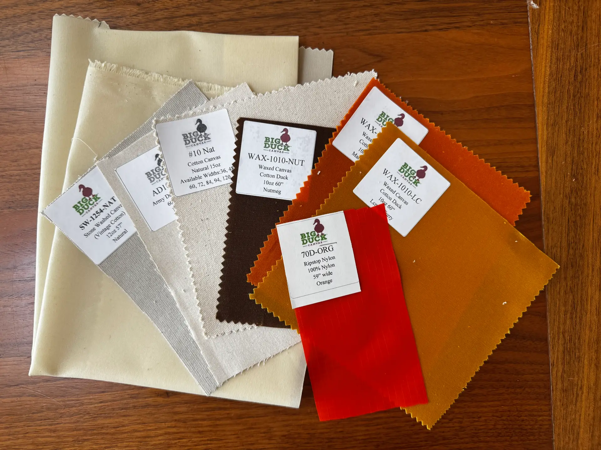

For the design, I was interested in trying out CAD software for sewing patterns.
I found [Seamly2D](https://github.com/FashionFreedom/Seamly2D), which seemed
like the most complete open-source option. To be honest though, I didn't last
long in it after realizing how simple the pattern for my first bag would be.

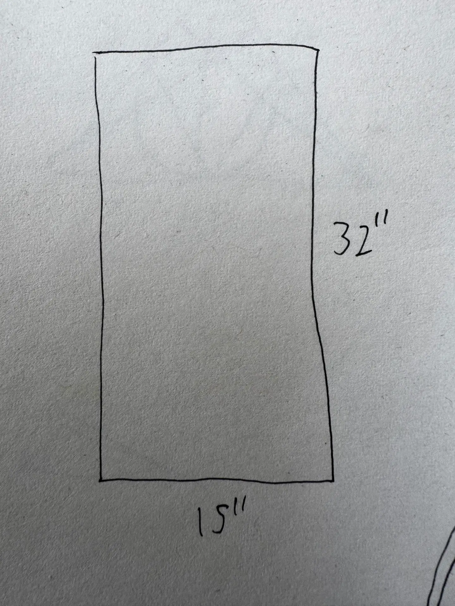

The design of this test bag was incredibly simple: just a rectangle folded in
half, sewn along the edges, and folded over around the rim.

Sewing this bag was pretty straightforward, but not without problems. I
got sloppy with the straps and accidentally sewed one on inside-out and left a
twist in the other, but still ended up with a reasonably functional bag!

The purpose of this first bag was for me to quickly get my hands dirty and learn
what non-obvious things I'd need to consider when designing and constructing my
next one, and to that end, this was a success!

## Coffee dying

I wanted the fabric to be just a shade darker than it was, and I'd heard of
people dying things with coffee, so I gave that a try. I did a test with
clippings of my sample fabrics. I ground some coffee beans as finely as my
grinder was able to, and brewed a bowl of coffee by dumping the grounds
directly into a bowl of hot water. After letting this brew for a few minutes, I
submerged the test samples.

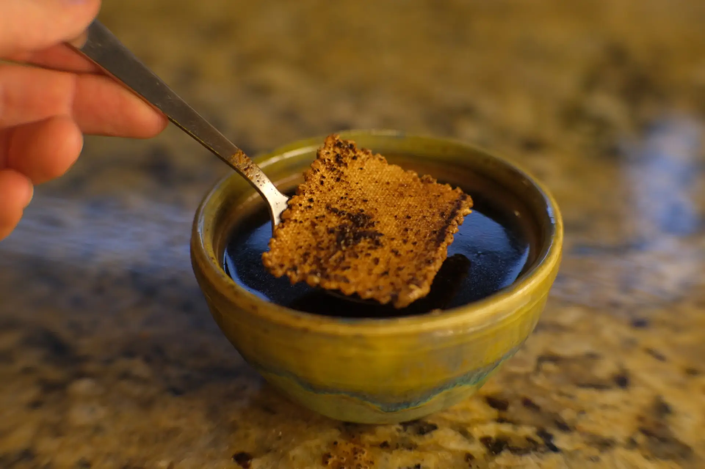

I tested with some waxed canvas, and some regular cotton canvas. Unsurprisingly,
the non-waxed canvas took the dye a bit better. I would have preferred the waxed
canvas even darker, but it was dark enough to satisfy me.

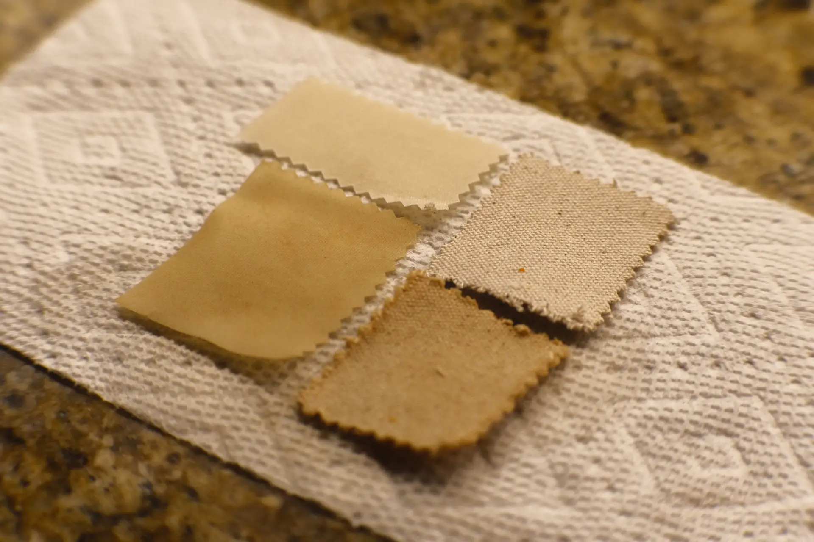

After that test, I cut out the pattern for my next bag and straps and dyed that
the same way I dyed the test samples.

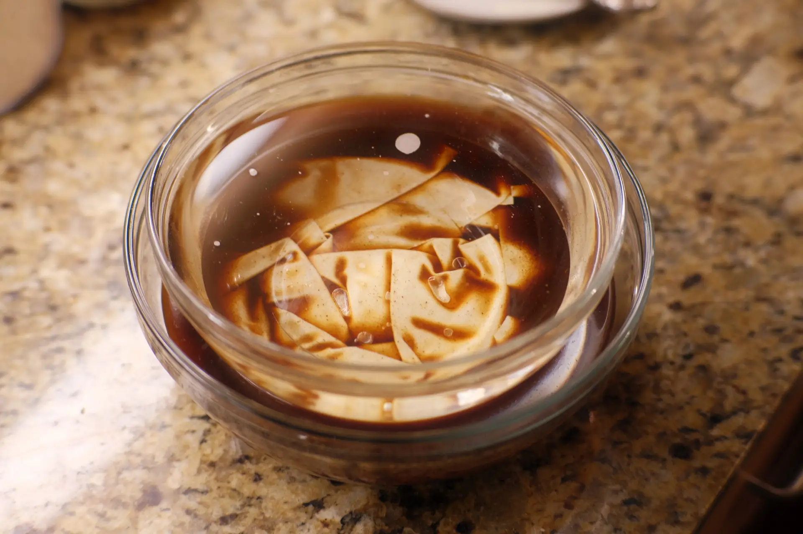

## Making the real bag

After spending some time using that first test bag, I decided on three main
improvements I'd like to make in the design of the next one:

1. I wanted a small inner pocket for easier access to my phone, keys, and
   wallet.
2. I wanted the inside of the bag to be lined with a different material for
   improved durability, feel, and visual appeal.
3. I wanted it to have some depth, rather than being completely flat.

With those changes, the design was a bit more complicated, but still simple
enough that I stuck with pen and paper rather than trying Seamly2D again.

I'm still a beginner seamster, but with the practice from the first bag, I was
more confident, fast, and accurate with this one.

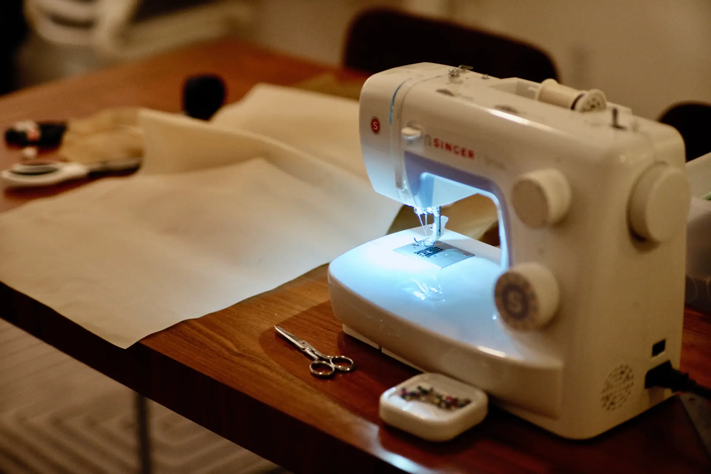

I'm happy with how this came out!
I used nylon ripstop for the inner lining, and I like the way that the materials
contrast. I haven't spent much time using the bag yet, but the extra depth and
pocket have already made it much more practical for regular use.

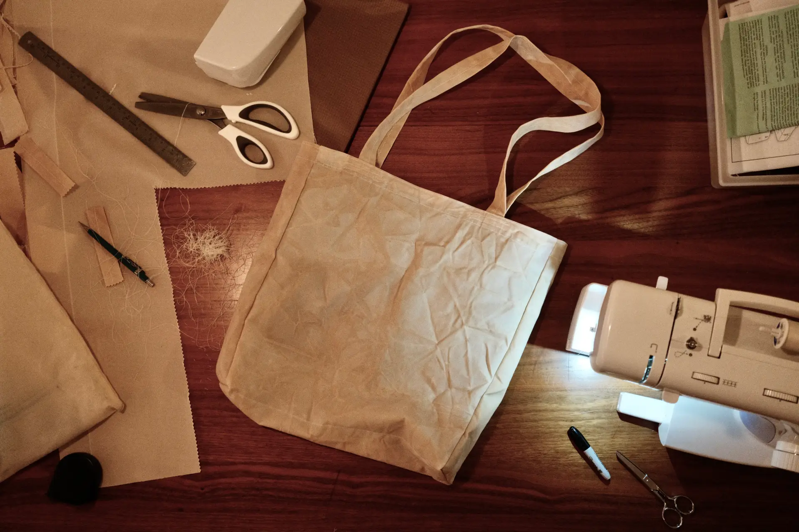
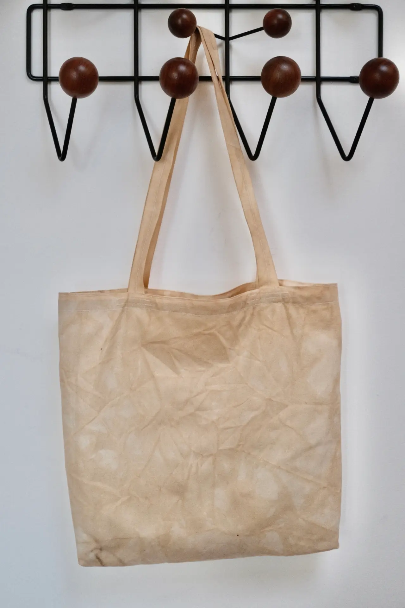
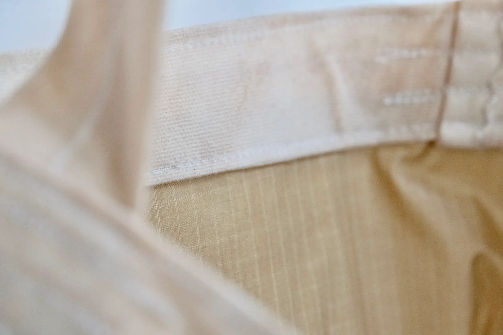
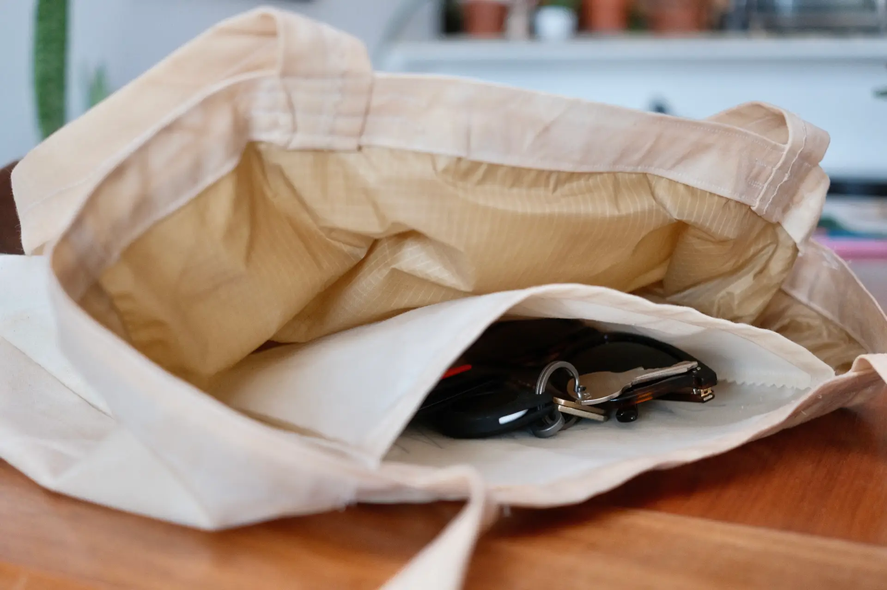
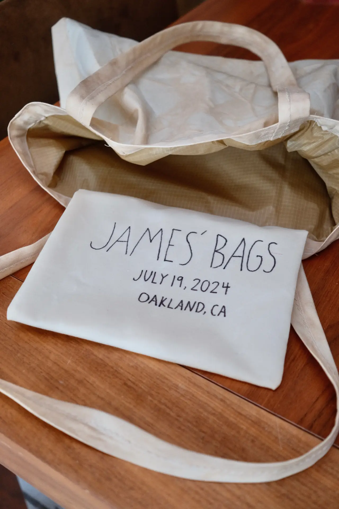

## What's next?

I'm already thinking about what I'd improve in future tote bags. There are
things I admire about other tote bags I've looked at:

- The inset zipper and adjustable shoulder strap from [Baggu's Duck
  Bags](https://www.baggu.com/products/horizontal-zip-duck-bag-black)
- The laptop sleeve clasp and extra pockets from [Klättermusen's
  Nagelfar](https://www.klattermusen.com/en/backpacks/tote-bags/10367-nagelfar-bag-17l-raven/)
- The water bottle storage and luggage pass-through strap from [Alpaka's Bravo
  Tote](https://alpakagear.com/products/bravo-tote)
- The reinforced bottom from [1733's Pocket
  Tote](https://www.seventeenthirtythree.com/shop/p/pocket-tote-vx21)
- The curves on Crumpler's bags, like the [Crumpler
  Tad](https://www.crumpler.com/products/tad?variant=40665142427727)

I'd like to incorporate some of those features while maintaining the look of a
simple canvas tote.
