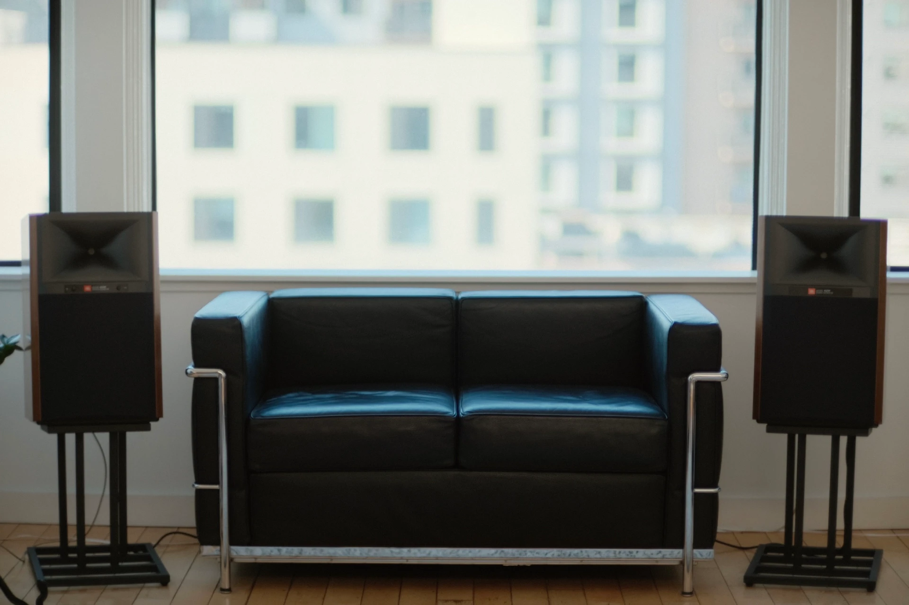
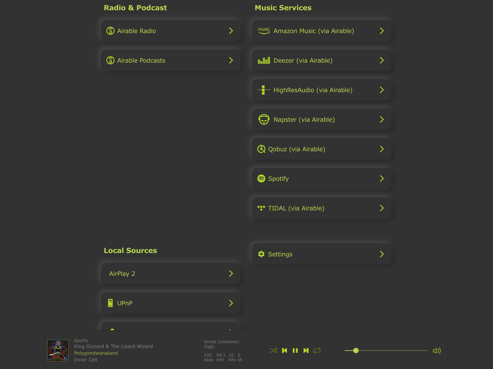
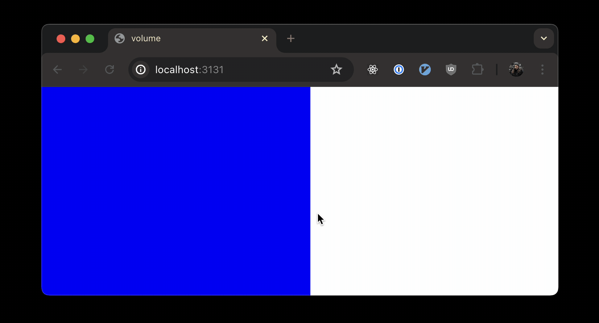
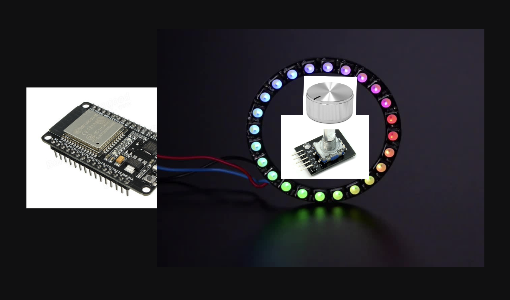

I got some fancy new speakers last week.

They're powered speakers and they have streaming service integrations built in,
unlike the 35-year-old passive speakers I'm upgrading from.
Overall they're great!
But they're so loud that it's difficult to make small volume adjustments within
the range of safe volume levels for my apartment.

To solve that, I'm building a custom volume knob for them them that will give me
more precise control within the range I like to listen in.



# The problem

The speakers sound great, but they're way louder than I need.
I typically use about 10% of the volume range they're capable of.

That makes it difficult to set the volume levels I prefer using the methods most
convenient for me, which are either the regular volume controls on my phone or
computer if I'm using AirPlay or the volume slider in Spotify if I'm using
Spotify Connect.
Those methods either give me a tiny slider that I can only use 10% of or about
15 steps where the jump from step 3 to step 4 takes the speakers from
"a bit too quiet" to "definitely bothering the neighbors" levels.

The amp that I used to use was overpowered for my room too, but that wasn't an
issue for me because those volume control methods attenuated the output of a
music streamer that I had connected to the amp.
With that system, I could set the amplifier's analog volume knob such that the
max volume out of the streamer corresponded to my actual maximum preferred
listening volume,
giving me access to the full range of Spotify or AirPlay's volume controls.

Some powered speakers solve this issue by providing control over the max volume,
either by a physical knob or by a software setting, but unfortunately these
JBLs do not.

# Finding a solution

While thinking about this problem, I remembered that some other
network-connected audio devices I've encountered expose undocumented web
interfaces.
I was curious if these speakers did, so I found their local IP address via my
router and navigated to that IP in my browser.

Lo and behold, they do have one!



Sadly, the volume slider there was still not as convenient as I'd like.

## Reverse-engineering the speakers' API

After exploring that web interface for a few minutes with my browser's network
dev tools, I found that the speakers expose a pretty straightforward HTTP API,
including `GET /api/getData` and `POST /api/setData`,
which allow me to read and write the current volume level, among other things.

I tried to find some documentation of this API online, but the closest I could
find was [the source code for a Hombridge plugin for KEF
speakers](https://github.com/jhnvz/homebridge-kef/blob/c3aeb327a1dcc6bfa9329513820315dbc18debd1/src/kef.ts#L200).
It seems like KEF's and JBL's network-connected speakers share some code, which
isn't too surprising given that they're both owned by
[Harman](https://en.wikipedia.org/wiki/Harman_International)
(which is apparently [owned by Samsung as of
2017](https://www.digitaltrends.com/business/samsung-harman-acquisition/)!)

After that, I found that the speakers' web interface has a page that allows me
to download system logs, which turned out to include a copy of the part of the
filesystem that stores the current settings!

```bash
$ tree ~/Downloads/temp_data_logs
/Users/james/Downloads/temp_data_logs
├── media
│  └── settings
│     └── settings
│        ├── airable
│        │  └── uniqueId
│        ├── airplay
│        │  ├── addedToHome
│        │  ├── deviceName
│        │  ├── pairingPreferences
│        │  └── password
│        ├── deviceName
│        ├── deviceNameChangeCount
│        ├── fwupdate
│        │  ├── enablePeriodicChecks
│        │  ├── resumeUpdateData
│        │  └── updateDescription
│        ├── googlecast
│        │  ├── bssid
│        │  ├── castVersion
│        │  └── deviceUniqueId
│        ├── hostlink
│        │  └── maxVolume
│        ├── locationCountry
│        ├── locationRegion
│        ├── mcuVersion
│        ├── mediaPlayer
│        │  ├── attenuation
│        │  ├── mute
│        │  └── playMode
│        ├── network
│        │  └── profile
│        ├── roon
│        │  └── uniqueId
│        ├── spotify
│        │  ├── blob
│        │  ├── presets
│        │  └── username
│        ├── system
│        │  ├── deviceUptime
│        │  ├── maxIdlePlayTime
│        │  ├── maxIdleTime
│        │  ├── memberId
│        │  ├── primaryMacAddress
│        │  └── serialNumber
│        ├── tidalConnect
│        │  └── networkInterface
│        ├── timezone
│        ├── upnpRenderer
│        │  └── udn
│        ├── versionLastBooted
│        └── www
│           ├── ftsComplete
│           ├── ftsGoogleCast
│           ├── ftsNetwork
│           └── ftsTimeZone
├── tmp
│  └── log
│     ├── bluez
│     ├── cast_shell
│     ├── cast_shell.0
│     ├── nSDK
│     ├── nSDK.0
│     ├── process_manager
│     ├── scwd
│     ├── system
│     ├── update_engine
│     ├── update_engine.0
│     ├── websocketd
│     ├── wpasupplicant
│     └── wpasupplicant.0
└── var
   └── log
      ├── messages
      └── messages.0
```

That helped me track down two specific configuration paths that looked
promising: `player/attenuation` and `hostlink/maxVolume`.

Sadly, neither of those turned out to be what I was looking for.

`player/attenuation` turned out to be another interface to the main volume,
more-or-less an alias of `player:volume`.

`hostlink/maxVolume` sounded like it could be exactly what I was hoping to find.
Unfortunately, changing it doesn't seem to affect anything that I've noticed,
and the API response implies that it has to do with
[Arcam](https://www.arcam.co.uk/) (yet another Samsung/Harman subsidiary):

```bash
$ curl --url 'http://192.168.1.239/api/getData?path=settings:/hostlink/maxVolume&roles=@all' | jq
{
  "timestamp": 1711309370908,
  "title": "Max volume setting (ARCAM-project specific)",
  "modifiable": true,
  "type": "value",
  "path": "settings:/hostlink/maxVolume",
  "defaultValue": {
    "type": "i32_",
    "i32_": 99
  },
  "value": {
    "type": "i32_",
    "i32_": 46
  }
}
```

## Building a custom volume-control webpage

If I couldn't set a max volume inside the speaker, I could at least build myself
a custom slider that only covers the range of volumes I'm interested in
listening at.

To do that, I put together a little web page with nothing but a full-width slider
for setting the volume, and I finally have a way to choose reasonable levels!



I tried to do that in a single HTML file, but ran into CORS issues when
sending requests to the speakers, so I put together a tiny server using Bun.
With that, I was able to keep it down to a single TypeScript file with no
dependencies other than Bun itself:

```typescript
// server.ts
// Run this via `bun --hot server.ts`

const MAX_VOLUME = 25;
const SPEAKER_URL = "http://192.168.1.239";
const UPDATE_INTERVAL_SECONDS = 10;

const getVolumeUrl = `${SPEAKER_URL}/api/getData?path=player:volume&roles=@all`;

function html(strings: TemplateStringsArray, ...values: any[]) {
  return strings.reduce((result, string, i) => {
    return result + string + (values[i] || "");
  }, "");
}

const pageHtml = html`<html>
  <head>
    <title>volume</title>
    <style>
      body {
        margin: 0;
      }

      #volume {
        -webkit-appearance: none;
        appearance: none;
        margin: 0;
        width: 100%;
        height: 100%;
        cursor: pointer;
        outline: none;
        background: linear-gradient(to right, blue var(--volume), white 0);
      }

      /* Hide the thumb */
      #volume::-webkit-slider-thumb {
        -webkit-appearance: none;
        appearance: none;
        width: 0;
        height: 0;
      }
      #volume::-moz-range-thumb {
        width: 0;
        height: 0;
      }
    </style>
  </head>
  <body>
    <input
      type="range"
      min="0"
      max="${MAX_VOLUME}"
      value="0"
      id="volume"
      disabled
    />
    <script>
      // Yes, this is JavaScript embedded in HTML embedded in TypeScript.

      function setBackgroundGradient() {
        const percentage = (volume.value / ${MAX_VOLUME}) * 100;
        document.body.style.setProperty("--volume", \`\${percentage}%\`);
      }

      // I only recently learned that you can reference elements by ID this way.
      // It's kind of horrible but also I love it on tiny pages like this.
      volume.oninput = async function setVolume() {
        fetch("volume", {
          method: "POST",
          body: JSON.stringify({ volume: volume.value }),
        });
        setBackgroundGradient();
      };

      async function getVolume() {
        const response = await fetch("volume");
        const body = await response.text();
        volume.value = body;
        volume.disabled = false;
        setBackgroundGradient();
      }

      getVolume();
      setInterval(getVolume, ${UPDATE_INTERVAL_SECONDS * 1000});
    </script>
  </body>
</html>`;

const server = Bun.serve({
  async fetch(request) {
    const url = new URL(request.url);

    switch (url.pathname) {
      case "/":
        return new Response(pageHtml, {
          headers: { "Content-Type": "text/html" },
        });

      case "/volume":
        switch (request.method) {
          case "GET": {
            const response = await fetch(getVolumeUrl);
            const body = await response.json();
            return new Response(body.value.i32_);
          }

          case "POST": {
            const { volume } = await request.json();

            console.log(`Setting volume to ${volume}.`);

            // I don't want to blow out the speakers or go deaf because of a bug
            // somewhere else in this code, so I check for high volumes here.
            if (volume > MAX_VOLUME) {
              console.error("That's too high!", volume);
              return new Response("Volume too high", { status: 500 });
            }

            return fetch(`${SPEAKER_URL}/api/setData`, {
              method: "POST",
              headers: {
                "Content-Type": "application/json",
              },
              body: JSON.stringify({
                path: "player:volume",
                role: "value",
                value: { type: "i32_", i32_: volume },
                _nocache: new Date().getTime(),
              }),
            });
          }
        }
    }

    console.error("Not found:", url.pathname);
    return new Response("Not Found", { status: 404 });
  },
});

console.log(`Server running on http://localhost:${server.port}.`);
```

The web server here is pretty small.
It just serves the page with the slider and forwards requests to the speakers.

I'm using that [tagged
template](https://developer.mozilla.org/en-US/docs/Web/JavaScript/Reference/Template_literals#tagged_templates)
just to get nicer syntax highlighting in my editor for the embedded HTML.

# What's next?

This works alright for now, but what I really want is a _physical_ volume knob
that I can place wherever it's convenient in my apartment.

In the next post in this series, I'll talk about building that, probably using
something like an ESP32 board with a rotary encoder,
a nice enclosure and a nice feeling knob, maybe with
some kind of haptic feedback for the stepped volume changes?



I haven't actually worked with those components before, and it's been a while
since I last worked on a hardware electronics project, but I'm excited to!
