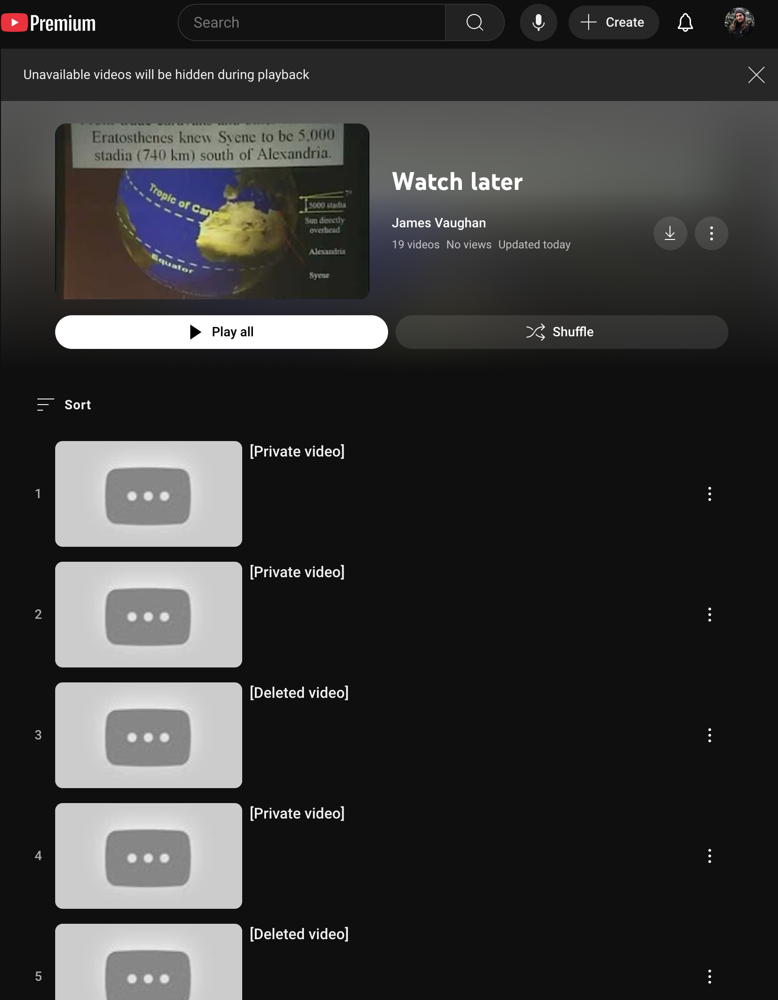

I'm a frequent user of YouTube's "Watch Later" feature, which lets you save
videos to a special playlist for later viewing.
My Watch Later list grows and shrinks as I add videos I'd like to watch and
remove videos that I've either watched or decided I no longer want to watch.

The length of time that a video will spend on my Watch Later list varies
significantly.
For a video that I add and watch in the same session, it may only remain on the
list for a few minutes.
For a video that I'd like to watch, aspirationally, but never _actually_ feel
like starting, it may remain on the list for months or years.

An interesting side-effect of this kind of Watch Later use is that the list
tends to accumulate references to videos that are no longer available for me to
watch.
This can happen when an uploader deletes a video or makes a video private, or if
a video is forcibly removed due to a copyright violation.

I call this my Watch Later Mystery Graveyard.

At this point, I have _no idea_ what each of these unavailable videos was,
and I am _so curious_.

Why was it taken down?

What secrets did it contain?

Did it simply include a mundane mistake that the uploader fixed in a subsequent
upload that I've already watched?

Or was it some video that I was unusually excited to watch that's now gone
forever?

---

I've thought a bit about how to avoid this mystery in the future.
One strategy would be to run `yt-dlp` in a cron job, regularly downloading all
of the videos (or at least each video's metadata) on the playlist.

If I end up putting a system like that in place, I'll come back here to document
it in case anyone else is interested in using it.

---

_update_: r721 on Hacker News
[pointed out](https://news.ycombinator.com/item?id=42635824) that I could use
the Internet Archive to look up archived snapshots of these video pages
(fortunately, YouTube leaves the original video URLs on the playlist page) and
it seems to work well!
